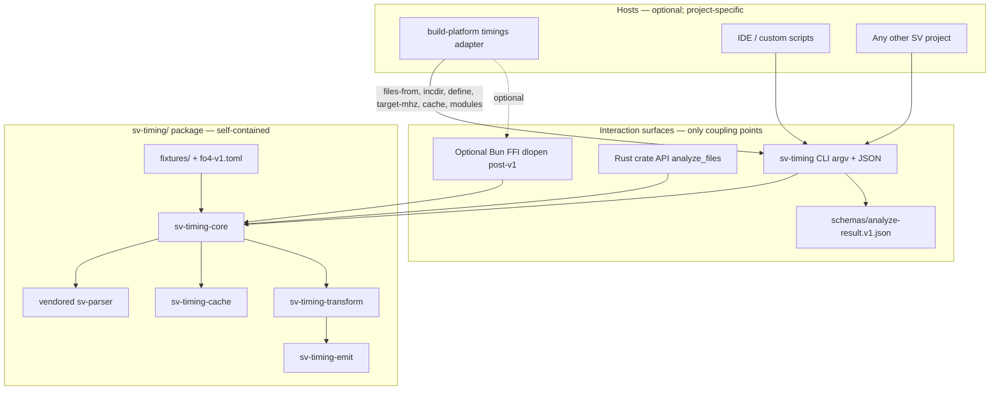
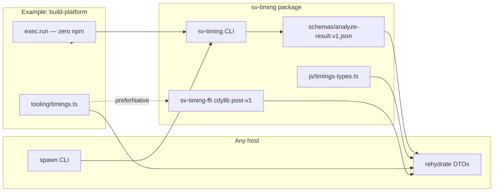
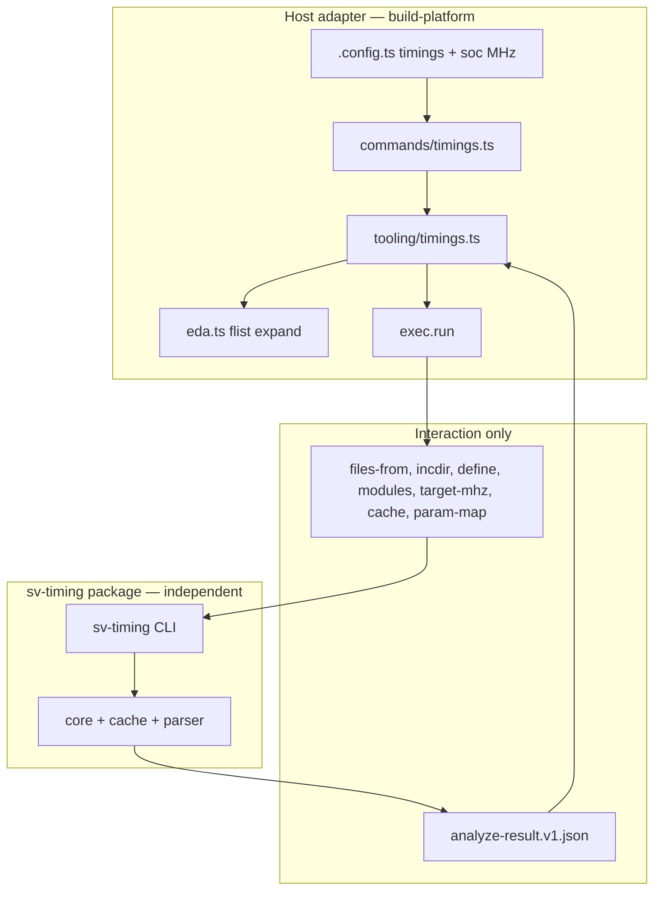

# Design: `sv-timing/` — Standalone SystemVerilog Timing AST Library, Auto-Correct Precompiler, and Host Integration

| Field | Value |
|---|---|
| **Document title** | `sv-timing/` package architecture (project-independent core) |
| **Author** | _(placeholder — Etienne Cimon / CVA6V-EC agents)_ |
| **Date** | 2026-08-01 |
| **Status** | Draft (rev 4 — independence boundary; host integration by import/CLI only) |
| **Primary package root** | `sv-timing/` (self-contained Rust workspace; may live in a monorepo or alone) |
| **Example host (this monorepo)** | CVA6V-EC `build-platform` via `timings` command — **optional consumer**, not a dependency |
| **Related governance (when monorepo-hosted)** | `AGENTS.md` §0, `AGENTS-coding-philosophy.md`, `AGENTS-configuration.md`, `AGENTS-licensing.md`, `build-platform/AGENTS.md` |

---

## Overview

Functionally correct SystemVerilog can still be structurally hostile to a high-frequency timing target. Long combinational clouds, expensive operators (multiply, divide, wide priority muxes), and weakly explicit sequencing typically surface only after synthesis and static timing analysis (STA), when restructuring is expensive. This design introduces a **standalone Rust package** under `sv-timing/` that **compiles an explicit list of SystemVerilog sources into a timing-oriented intermediate representation (IR)**: operators, sequential elements, gating conditions, and path endpoints, each tied to precise `file:line:column` origins.

**Independence is a hard requirement.** The `sv-timing/` codebase builds, tests, and runs with **no compile-time or runtime dependency** on CVA6 RTL, `build-platform`, flist expanders, SoC config packages, or monorepo paths. Any project-specific knowledge (flist expansion, `TARGET_CFG`, package name maps, default MHz, refuse path prefixes) lives **outside** the package, in a **host adapter** that prepares inputs and consumes JSON (or later FFI) outputs.

The same core is used through three **interaction modes** (not three product forks):

1. **Standalone CLI** (`sv-timing`) — make-like compile-to-timing over `--files` / `--files-from`, reports, opportunities, optional correct. **v1 required path.** Works from any working directory with only Rust + sources.
2. **Library / process API** — `sv-timing-core` (`analyze_files`) and versioned JSON schema for any language host that spawns the CLI or links the crate.
3. **Host adapters** (optional) — e.g. monorepo `build-platform` `timings` command, or a future IDE plugin. Adapters **import/interact** with `sv-timing`; they do not pull monorepo code into the crate graph.

Optional **auto-correct** (expert, allowlisted) measures on the IR, applies scope-safe transforms, re-measures, and emits rewritten SystemVerilog with edit traces. Structural FO4 estimates are **not** STA sign-off.

---

## Background & Motivation

### Problem (project-agnostic)

Designers write SystemVerilog that simulates correctly but fails frequency targets because combinational structure, expensive operators, and implicit enables are opaque until late STA. An early **source-level** “compile to timing” loop—independent of any one SoC tree—is the product.

### Why a separate package

Coupling a timing AST tool to one monorepo’s flist expander, config packages, or Bun CLI would:

- Prevent reuse on other SV projects (IP blocks, third-party RTL, non-CVA6 cores).
- Force every consumer to vend CVA6 env vars (`CVA6_REPO_DIR`, `HPDCACHE_DIR`, …).
- Make CI/unit tests depend on a multi-GB RTL tree.

Therefore **`sv-timing` owns language → IR → cost → report → correct** only. **Hosts own project discovery** (which files, which defines, which MHz, where to put cache).

### Example host context (this monorepo only — not part of the package)

When `sv-timing` is checked into the CVA6V-EC tree, one optional host is **build-platform**:

- Flist expansion already lives in `build-platform/src/tooling/eda.ts` (`flattenFlist`, `writeFlatManifest`, `edaEnv` with `CVA6_REPO_DIR` / `TARGET_CFG` / `HPDCACHE_DIR`).
- Target frequency already lives in `SocConfig.targetFrequencyMHz` (default **1250**).
- Zero runtime npm deps; commands register in `registry.ts`.

That host **calls** `sv-timing` after expanding a file list. Removing build-platform or moving `sv-timing/` to its own git repository must leave the Rust package fully usable.

### Pain points

1. Critical-path depth discovered only after STA.
2. No portable source-level ranking vs a configurable FO4 budget.
3. Pipeline suggestions are tribal knowledge.
4. Host build systems (including this monorepo’s platform) lack a standard way to invoke early structural timing without inventing a second parser.
5. Custom UIs need a stable IR/JSON contract, not monorepo-private types.

### Why now (host motivation)

In CVA6V-EC, structural timing feedback next to `soc.targetFrequencyMHz` closes the SoC-readiness loop. That motivation justifies **host wiring**, not baking CVA6 into `sv-timing-core`.

---

## Goals & Non-Goals

### Goals

| ID | Goal |
|---|---|
| G0 | **`sv-timing/` is project-independent:** `cargo test` / `cargo build` / CLI analyze succeed with only `sv-timing/` + fixtures; no monorepo paths, no `build-platform` crates, no CVA6 RTL required. |
| G1 | Parse multi-file SystemVerilog with **precise source locations**, preferring an **adapter over upstream `Locate`** plus origin maps; vendor patches only where the adapter is insufficient. |
| G2 | Lower to a **timing IR** with operator classes, FO4-style costs, gating (clock/edge/enable/reset), and path endpoints (reg/in/out). |
| G3 | Rank paths and regions against a **caller-supplied** target frequency (CLI default **1000 MHz** if omitted; hosts may pass 1250). |
| G4 | Extract **pipeline opportunities** with `file:line` anchors. |
| G5 | Optional **auto-correct**: measure → conservative transform → re-measure → emit SV + edit trace (expert, allowlisted). |
| G6 | **CRC-of-files + SQLite** cache for partial IR rebuild; cache path is **caller-chosen** (default `./.sv-timing-cache/`). |
| G7 | **Stable interaction surfaces:** CLI + versioned JSON schema (required); optional Bun/Node **FFI (dlopen)** post-v1 for native objects. Hosts rehydrate DTOs; they do not reimplement cost models. |
| G8 | **Host integration by composition only** — adapters prepare file lists / defines / MHz / cache dir and spawn or link `sv-timing`. Example host: monorepo `timings` command. |
| G9 | License net-new crates as **MIT** (Etienne Cimon) when under this monorepo’s policy; keep upstream **sv-parser** license intact. Standalone re-license of the package is out of scope of this design. |

### Non-Goals

| ID | Non-goal |
|---|---|
| NG1 | Replace STA, SDF, or foundry sign-off. FO4 numbers are structural estimates only. |
| NG2 | Full IEEE 1800 elaborator in v1 — progressive resolution (P1 → P1.5 → P2…). |
| NG3 | Synthesize, place, or route. |
| NG4 | Automatically merge rewritten RTL into a host’s `core/` (or any project tree) without human review; never auto-commit corrected trees. |
| NG5 | Compile- or link-time dependency of `sv-timing` on `build-platform`, CVA6 packages, or monorepo `util/`. |
| NG6 | Commit NDA PDK content or process-calibrated FO4 tables under NDA. |
| NG7 | Formal functional equivalence of auto-correct. Integrity v1 = reparse + **structural checks** + golden FO4 on fixtures; optional sim is future. |
| NG8 | Own flist/`-F` expansion, Bender, FuseSoC, or any project manifest format inside the core (hosts convert those to file lists). |
| NG9 | Absolute FO4 CI gates in v1 (reports only until the model is trusted). |

---

## Proposed Design

### Independence boundary (normative)



| Layer | May know about | Must not know about |
|---|---|---|
| **`sv-timing/*` crates** | IEEE SV syntax, IR, FO4 table, SQLite, generic package/param maps | `build-platform`, `core/Flist.cva6`, `ariane_pkg`, `edaEnv`, `CVA6Cfg`, monorepo `workspace/` layout |
| **CLI** | File paths, incdirs, defines, MHz, modules, cache path, `--param-map` / `--cfg-snapshot` JSON | How the host discovered those paths |
| **Host adapter** | Project flists, SoC config, refuse path lists, default MHz | Reimplementing parser/cost/IR |

**Allowed host → package inputs (complete list for v1):**

| Input | CLI / API | Notes |
|---|---|---|
| Source files | `--files` / `--files-from` | Absolute or CWD-relative paths; host expands flists **before** invoke |
| Include dirs | `--incdir` (repeatable) | |
| Defines | `--define NAME[=VAL]` | Host may collect from flists |
| Module roots | `--modules` (required unless `--all-modules`) | Empty = **error** (operator must choose scope) |
| Frequency | `--target-mhz` | Default **1000** if omitted |
| FO4 ps / margin | `--fo4-ps`, `--budget-margin` | |
| Cost model id | `--cost-model fo4-v1` | Loads packaged `resources/` |
| Package mode | `--package-mode off\|packages` | Generic package parse; not a project name |
| Width default | `--assume-xlen N` | Generic bitness for unknown widths |
| Param / cfg map | `--param-map path.json` | Free-form `{"CVA6Cfg.XLEN":64,…}` supplied **by host** if needed |
| Multi-cycle tags | `--multi-cycle-modules a,b` | Names only |
| Correct gates | allowlist, refuse path prefixes, `--allow-latency` | Refuse prefixes are CLI lists, not hard-coded monorepo dirs |
| Cache / report | `--cache`, `--json-out`, `--emit-dir` | Defaults under `./.sv-timing-cache/` and `./.sv-timing-out/` |

**Independence acceptance tests (must stay green offline):**

1. Clone or extract only `sv-timing/` → `cargo test --workspace` passes using **fixtures only**.
2. `sv-timing analyze --files-from fixtures/filelist.txt --modules comb_adder_cloud --target-mhz 1000` produces valid `analyze-result.v1` JSON with no env vars set.
3. No `Cargo.toml` path dependency escapes `sv-timing/`.
4. No source file under `sv-timing/crates/**` matches `build.platform|ariane_pkg|CVA6Cfg|HPDCACHE|Flist\.cva6` (lint/grep in CI of the package).

---

### Package layout

```
sv-timing/                        # SELF-CONTAINED package root
  Cargo.toml                      # workspace root (Rust edition 2021+)
  Cargo.lock
  README.md                       # standalone usage first; monorepo host as optional appendix
  .gitignore                      # target/, .sv-timing-cache/, .sv-timing-out/
  LICENSE.NOTICE-sv-parser
  schemas/
    analyze-result.v1.json        # contract for ALL hosts
  resources/
    fo4-v1.toml
  crates/
    sv-parser/                    # vendored upstream (local customization)
    sv-timing-core/
    sv-timing-transform/
    sv-timing-emit/
    sv-timing-cache/
    sv-timing-cli/                # binary name: sv-timing
    sv-timing-ffi/                # optional post-v1 Bun FFI (cdylib)
  benches/
  fixtures/                       # ONLY RTL the package tests against by default
  tests/
  tools/
    vendor-sv-parser.md           # self-contained refresh (git clone + patch apply)
    refresh-sv-parser.sh
    refresh-sv-parser.ps1
  patches/
    sv-parser/
  js/                             # optional: types + thin wrapper (no monorepo deps)
    package.json                  # @sv-timing/types or similar; schema + TS DTOs only
    timings-types.ts
```

**Rust workspace:** path-dep only on vendored `sv-parser` inside this tree. Features: `cli` (default), `correct`, `ffi` (off by default).

**Vendoring sv-parser (self-contained, no monorepo `util/vendor.py` required):**

| Method | Role |
|---|---|
| **Primary** | `tools/refresh-sv-parser.{sh,ps1}`: pin rev, clone into `crates/sv-parser`, apply `patches/sv-parser/*`, copy LICENSE |
| **Optional monorepo convenience** | If checked into CVA6 tree, host may *also* call `util/vendor.py` with an hjson that targets `sv-timing/crates/sv-parser` — equivalent output, not a package dependency |

**Where artifacts land:**

| Context | Cache / reports / emit / binary |
|---|---|
| **Standalone (default)** | `./.sv-timing-cache/cache.sqlite`, `./.sv-timing-out/`, `cargo run -p sv-timing-cli` |
| **Host: this monorepo’s build-platform** | Host maps to `workspace/.cache/timings/`, `workspace/build/timings/`, `workspace/tooling/sv-timing/` via **CLI flags only** |

The package never hardcodes `build-platform/workspace`.

---

## Independence & Host Integration

### Interaction modes

| Mode | Who uses it | Coupling |
|---|---|---|
| **A. CLI subprocess** | Scripts, make, build-platform `exec.run` | argv + JSON files/stdout; process isolation |
| **B. Rust library** | Other Rust tools | `sv-timing-core` as path/crates.io dep |
| **C. Bun/Node FFI (post-v1)** | TS apps wanting in-process IR objects | `dlopen` cdylib from a path the **host** configures; same schema as JSON |
| **D. Host adapter module** | Monorepo-only glue | Lives **outside** `sv-timing/` (e.g. `build-platform/src/tooling/timings.ts`) |

### Host responsibilities (design pattern)

```
Host:
  1. Resolve project file list (flist / Bender / manual)
  2. Resolve incdirs + defines
  3. Choose target-mhz, modules, cache dir, refuse prefixes
  4. Optionally build param-map.json (project typedef/XLEN substitutions)
  5. Spawn: sv-timing analyze ... 
  6. Parse JSON → DTOs → UI / logs / gates
  7. On correct: review emit-dir; never auto-merge to RTL

sv-timing:
  1. CRC + SQLite partial rebuild
  2. Parse / scope / lower / cost / paths / opportunities
  3. Emit schema-valid JSON + human reports
  4. Optional correct under allowlist
```

### Example host profile (informative, not compiled into core)

A CVA6 host adapter **may** set:

```json
{
  "target_mhz": 1250,
  "assume_xlen": 64,
  "package_mode": "packages",
  "param_map": { "CVA6Cfg.XLEN": 64 },
  "multi_cycle_modules": ["serdiv"],
  "refuse_path_prefixes": ["vendor/"],
  "refuse_instance_types": ["tc_clk_gating"],
  "modules": ["alu", "mult", "multiplier"]
}
```

These are **CLI arguments / JSON files** produced by the host. Another SoC host would pass different maps without forking `sv-timing`.

---

## Multi-Step Architecture

```mermaid
flowchart TB
  subgraph host [Host adapter — outside package]
    DISC0[Stage 0 Host discovery: flists → files/incdirs/defines]
    FLAGS[target-mhz modules cache param-map]
  end

  subgraph cacheLayer [Inside sv-timing — SQLite IR-only]
    CRC[Per-file CRC hex TEXT]
    DB{(cache.sqlite WAL)}
    IRHIT[modules.crc_set hit → reuse IR]
    IRMISS[modules.crc_set miss → re-lower]
  end

  subgraph core [Inside sv-timing — stages 1–10]
    PARSE[1 Parse from disk]
    SCOPE[2 Scope + packages]
    IR[3 Timing IR]
    COST[4 FO4 cost]
    PATH[5 Paths]
    RANK[6 Rank]
    OPP[7 Opportunities]
    XF[8 optional correct]
    RPT[9 Reports JSON]
    CWR[10 Cache commit]
  end

  DISC0 --> FLAGS
  FLAGS --> CRC
  CRC --> DB
  DB --> IRHIT
  DB --> IRMISS
  IRHIT -->|skip 1–4 for module| COST
  IRMISS -->|reparse ALL files in module set| PARSE
  PARSE --> SCOPE --> IR --> COST --> PATH --> RANK --> OPP
  OPP --> XF
  RANK --> RPT
  OPP --> RPT
  XF --> RPT
  IR --> CWR
  PATH --> CWR
  RPT --> CWR
  CWR --> DB
```

> **IR-only invariant (read before coding PR 3):** A CRC **file hit** means “content unchanged vs last successful analyze” and is used only to (a) compute `crc_set` and (b) decide which modules are dirty. It does **not** mean “CST available without reading disk.” There are **no CST blobs** in v1. Therefore any module with an **IR miss** must **reparse from disk every file in that module’s contributing file set**, including files whose CRC still matches.

### Stage catalog

| # | Stage | Owner | Inputs | Outputs | Cache boundary |
|---|---|---|---|---|---|
| 0 | **Host discovery** | **Host only** (or human-written file list) | project manifests / flists / manual lists | ordered files, incdirs, defines, optional nested-manifest CRCs for fingerprint | Host may embed nested CRCs into `--define` / a sidecar `--pp-extra` file; package does not expand `-F` |
| 0b | **Ingest** | `sv-timing-cli` | argv file list | normalized absolute paths, `pp_fingerprint` | Fingerprint = files + incdirs + defines + versions (+ optional host-supplied nested CRC list) |
| 1 | **Parse** | sv-parser + location adapter | file bytes | CST + `SourceLoc` | File identity in `files` (CRC + pp + parser_version); no CST blob |
| 2 | **Scope / refs** | `sv-timing-core` | CST + package mode + optional param map | `SymbolTable`, use-def | Feeds module IR key |
| 3 | **Lower to timing IR** | `sv-timing-core` | resolved CST | `TimingModule` IR | `modules` IR blob |
| 4 | **Cost attribution** | `sv-timing-core` | IR + `fo4-v1.toml` | node/region costs | Inside IR blob |
| 5 | **Path extraction** | `sv-timing-core` | IR | `TimingPath[]` | Optional with `run_id` |
| 6 | **Rank vs budget** | `sv-timing-core` | paths + target | slack_fo4 ordered | Report-time |
| 7 | **Pipeline opportunities** | `sv-timing-core` | ranked paths | `Opportunity[]` | Report-time |
| 8 | **Auto-correct** (optional) | transform + emit | IR + allowlist | new IR, SV, `EditTrace` | Separate `runs.kind=correct` |
| 9 | **Report emit** | CLI | design | text + JSON (schema v1) | Caller `--json-out` / default `.sv-timing-out/` |
| 10 | **Cache commit** | `sv-timing-cache` | stage outputs | SQLite rows | Single transaction |

### Subcommand → stages map (authoritative — package CLI)

Package binary name: **`sv-timing`**. Hosts may wrap these with a different UX name (e.g. `cva6-build timings analyze` → `sv-timing analyze …`).

| User command | Stages | Flags / notes |
|---|---|---|
| `sv-timing status` | read `meta` + `runs` | requires `--cache`; works offline |
| `sv-timing analyze` | **0b → 7**, **9 → 10** | **Requires `--modules` or `--all-modules`**. Default includes paths + opportunities. `--no-paths` stops after stage 4. `--force` ignores IR hits. |
| `sv-timing report` | **9** (or analyze if no last run) | `--line-by-line`, `--json` |
| `sv-timing paths` | **5–6** or analyze **0b–6** | `--top N` |
| `sv-timing opportunities` | **7** or analyze **0b–7** | |
| `sv-timing correct` | **8 → 9** | expert; see gates |
| `sv-timing clean` | wipe `--cache` DB + optional out dir | |

Host wrapper example (`timings status`): may exit 0 if binary missing and print install hint — that UX is **host-only**, not package behavior.

### Partial rebuild — Cache v1 algorithm (normative)

**Init (every open):**

```sql
PRAGMA journal_mode=WAL;
PRAGMA busy_timeout=5000;
-- No FOREIGN KEY constraints are declared on timings tables; do not rely on
-- SQLite CASCADE. Application code owns file_modules lifecycle (see step 7).
-- foreign_keys pragma is intentionally omitted (no FKs to enforce).
```

**CRC algorithm (frozen for schema v1):** **CRC-32C** (Castagnoli), stored as **lowercase hex TEXT** (8 hex chars), meta key `crc_algo = "crc32c"`. Rationale: fast, well-supported (`crc32c` crate), avoids SQLite signed INTEGER pitfalls for 64-bit values. Collision risk is acceptable when combined with `path` + `size` + `pp_fingerprint`.

**Storage policy v1: IR-only.** Do **not** store CST blobs in SQLite. Large multi-IP file lists would multi-GB the DB if CSTs were cached. Consequences:

| Situation | Action |
|---|---|
| Module **IR hit** (`modules` PK match) | Reuse `ir_blob`; **skip parse + scope + lower + cost** for that module. |
| Module **IR miss** | **Reparse from disk every file in the module’s contributing file set** (CRC-clean siblings included), then scope → lower → cost. CRC hits do **not** skip parse when re-lower is required. |
| Optional later (not v1) | Content-addressed CST blob cache keyed by `(crc, parser_version)` as a pure optimization. |

**pp_fingerprint** = SHA-256 (hex) of the canonical serialization of:

1. Sorted absolute POSIX file paths in the flattened list (or analysis closure — see module filter).
2. Sorted incdirs.
3. Sorted defines (`TimingsConfig.defines` ∪ collected defines if flattener extended).
4. Sorted list of **nested manifest paths** touched during flatten + each nested file’s CRC-32C (so editing `hpdcache.Flist` invalidates without touching the top flist text only).
5. `parser_version`, `ir_version`, `cost_model_version` (`fo4-v1`).

**Steps (implement exactly):**

1. **Stage 0/0b — Discovery + ingest:** Host (or human) supplies ordered `files[]`, `incdirs[]`, `defines[]`, and module roots. Package builds `pp_fingerprint` (optional host-supplied nested-manifest CRC list via `--pp-extra` JSON). Analysis **closure** = files defining roots ∪ package sources when `package_mode=packages` ∪ any extra files on the list (host should include packages on the file list / incdirs).
2. **CRC all inputs:** compute CRC-32C hex for every path in the closure.
3. **File metadata reconcile (not a parse gate):**
   - Lookup `files` by PK `(path, pp_fingerprint, parser_version)`.
   - If row exists and `crc` matches → mark path **content-stable** (metadata hit).
   - If row exists and `crc` differs → **DELETE** that `files` row; mark path **content-changed**.
   - If no row → mark path **new**.
   - Query `file_modules` for content-changed and new paths → set of **candidate dirty module names**. Also, any module whose stored `crc_set` will not match the newly computed set is dirty (step 4).
   - **Important:** “content-stable” is **not** permission to skip parse on IR miss. It only feeds `crc_set` and dirty detection.
4. **Per-module `crc_set`:** for each module under analysis, let `F(m)` = sorted list of absolute paths that contribute to `m` (definition file + any multi-file partials; packages used only for P1.5 are tracked as their own “units” or as deps of roots — see filter closure).  
   `crc_set(m) = sha256(join(path_i || ":" || crc_i))` over `F(m)`.
5. **IR lookup / rebuild (normative reparse rule):**
   - If `modules` PK `(module_name, crc_set, ir_version)` **hits** → **IR hit**: load `ir_blob`; skip stages 1–4 for `m`.
   - If **miss** → **IR miss**:
     1. Let `NeedParse = F(m)` (**entire** contributing set, union any package files required for P1.5 resolution of `m`).
     2. **For each path in `NeedParse`, read bytes from disk and parse** (even if content-stable). In-memory CST only; nothing read from a CST column.
     3. Scope / resolve (P1.5) over those CSTs → lower → cost → new IR.
   - Worked example: root module `m` plus package files on the file list; designer edits only `m.sv`. Then `crc_set(m)` changes → IR miss → reparse **`m.sv` and package sources still needed for package mode**, even though package CRCs are unchanged.
6. **Paths (stage 5):** per-module only in v1. No inter-module re-stitch until P2 populates `module_deps` from instances.
7. **Transactional commit (stage 10):** `BEGIN IMMEDIATE` … `COMMIT`:
   - Upsert `files` metadata for every path in the run closure (`crc`, `size`, `mtime_ns`, …).
   - **`file_modules` lifecycle (application-owned, no FK CASCADE):**  
     - `DELETE FROM file_modules WHERE path IN (closure_paths)` **or** rebuild: delete all rows whose `path` is not in the current closure, then  
     - `INSERT` fresh `(path, module_name)` pairs discovered during this run’s lowers / header scans.  
     - Stale rows after flist membership changes must not survive a successful commit.
   - Upsert `modules.ir_blob` for rebuilt modules; leave untouched IR-hit modules as-is.
   - Insert `runs`, `reports`, `paths` for `run_id`.
8. **Retention:** keep last `N` runs (`--cache-keep-runs`, default **10**); delete older `runs` / `paths` / `reports`. `sv-timing clean --cache …` deletes the DB file.

**Dirty fan-out:** `file_modules(path, module_name)` answers “which module IR keys to recompute when path P’s CRC changes” in O(k). It does **not** supply ASTs.

**Parse memoization within a single process run (allowed):** if two IR-miss modules share a package file, parse that file once into an in-memory map `path → CST` for the duration of the analyze invocation. That memo is **not** persisted.

---

## Detailed Component Design

### 1. Local `sv-parser` customization + location architecture

**Upstream:** [dalance/sv-parser](https://github.com/dalance/sv-parser). License preserved verbatim.

#### Location architecture (implementable)

**Prefer adapter in `sv-timing-core`, not a deep fork of every syntax node.**

Upstream already exposes:

- Leaf **`Locate`** (byte offset into preprocessed text) on many nodes.
- **`SyntaxTree::get_str`** / string slices from the tree.

**`sv-timing-core::loc` adapter (new):**

```rust
// NEW — conceptual
pub struct SourceLoc {
    pub file: Arc<str>,       // preferred: original user path when origin map hits
    pub start_line: u32,
    pub start_col: u32,
    pub end_line: u32,
    pub end_col: u32,
    pub byte_start: u32,      // in the buffer used for line map
    pub byte_end: u32,
    pub origin: OriginKind,   // UserFile | ExpandedMacro | Unknown
}

pub enum OriginKind { UserFile, ExpandedMacro, IncludeExpanded, Unknown }

/// Map Locate → SourceLoc using:
/// 1) preprocessed buffer line index
/// 2) origin map from sv-parser-pp (include/macro stack) when available
pub fn locate_to_source(
    tree: &SyntaxTree,
    loc: Locate,
    origins: &OriginMap,
) -> SourceLoc;
```

**Minimum node set that must resolve to nonzero line/col after adapter (+ tests):**

| Syntax concern | Examples |
|---|---|
| Module header | `module` name, ports |
| Event control | `@(posedge clk_i or negedge rst_ni)` |
| Procedural | `always_ff`, `always_comb`, `always_latch` (flag only) |
| Net assignment | continuous `assign` |
| Operators | binary, unary, conditional `?:` |
| Sequential LHS | nonblocking `<=` targets |

**Include / macro origin stack:**

- When `sv-parser-pp` provides source mapping, `primary_loc` and line reports **must** point into the **original** `.sv` (or package) path.
- **Failure mode:** if origin is lost, emit location against the expanded buffer path **and** set `OriginKind::Unknown` + warning `LOC_ORIGIN_LOST` in the report header (never silent).

**Vendor patches (only if adapter cannot get lines for the minimum set):**

| Patch file (ordered) | Intent |
|---|---|
| `0001-expose-origin-map-api.patch` | Stable API to query include/macro origin from pp (if missing upstream) |
| `0002-locate-helpers.patch` | Helpers to walk Locate on always/assign/ops if gaps found |

PR 1 acceptance: golden tests under `fixtures/multi_file/` (include + `` `define ``) assert `primary_loc.file` ends with the **user** `.sv` name, not only a temp expand path, when origin map exists.

#### Vendor workflow (package-owned, v1)

**Primary (works without monorepo tooling):**

```bash
# from sv-timing/
./tools/refresh-sv-parser.sh <git-rev-or-tag>
# Windows: .\tools\refresh-sv-parser.ps1 <git-rev-or-tag>
```

Scripts: pin rev in `tools/sv-parser.rev`, clone dalance/sv-parser into `crates/sv-parser`, apply `patches/sv-parser/*.patch` in order, retain upstream LICENSE/NOTICE.

**Optional monorepo convenience only** (not required to build):

```bash
# from monorepo root, if desired:
python3 util/vendor.py --update sv-timing/sv-parser.vendor.hjson
```

Document both in `sv-timing/tools/vendor-sv-parser.md`. **Never** re-license parser crates as proprietary.

---

### 2. Timing IR (`sv-timing-core`) — **new API**

```rust
// NEW — sv-timing-core (conceptual)

pub struct SourceLoc { /* as above */ }

pub enum OperatorClass {
    LogicBit, Compare, ShiftConst, ShiftVar,
    AddSub, Mul, DivRem, Mux, PriorityMux, Concat, Other,
}

pub struct GateInfo {
    pub clock: Option<SignalRef>,
    pub edge: Option<EdgeKind>,
    pub enable: Option<ExprId>,  // e.g. mult_valid_i
    pub reset: Option<ResetInfo>,
    pub is_comb: bool,
}

pub enum PathEndpoint {
    RegClock { cell: SeqCellId },
    RegData  { cell: SeqCellId },
    InputPort { module: ModuleId, port: PortId },
    OutputPort { module: ModuleId, port: PortId },
}

/// v1 region = one always_comb / always_ff body / continuous assign process cone
pub struct CombRegion {
    pub id: RegionId,
    pub kind: RegionKind,       // AlwaysComb | AlwaysFf | ContAssign
    pub nodes: Vec<NodeId>,
    pub total_fo4: f64,
    pub loc_span: SourceLoc,    // covering span of the process
    pub multi_cycle: bool,      // heuristic or module tag
}

pub struct IrNode {
    pub id: NodeId,
    pub kind: IrNodeKind,
    pub op_class: Option<OperatorClass>,
    pub width: u32,             // inferred or default
    pub fo4_cost: f64,
    pub gate: Option<GateInfo>,
    pub loc: SourceLoc,
    pub fans_in: Vec<NodeId>,
    pub fans_out: Vec<NodeId>,
}

pub struct TimingPath {
    pub id: PathId,
    pub region_id: RegionId,
    pub start: PathEndpoint,
    pub end: PathEndpoint,
    pub nodes: Vec<NodeId>,
    pub total_fo4: f64,
    pub slack_fo4: f64,
    pub primary_loc: SourceLoc, // highest-cost node in path
    pub multi_cycle: bool,
}

pub struct Opportunity {
    pub kind: OpportunityKind,  // InsertReg | SplitAssign (BalanceMux deferred)
    pub path_id: PathId,
    pub insert_after: NodeId,
    pub estimated_fo4_before: f64,
    pub estimated_fo4_after: f64,
    pub loc: SourceLoc,
    pub rationale: String,
    pub requires_clock_in_scope: bool,
    pub changes_latency: bool,  // true for InsertReg always
}

pub struct TimingDesign {
    pub modules: BTreeMap<ModuleId, TimingModule>,
    pub paths: Vec<TimingPath>,
    pub opportunities: Vec<Opportunity>,
    pub target: TimingTarget,
    pub versions: VersionBanner, // schema/ir/cost/parser — mandatory in reports
}
```

**Public entrypoints (new):**

```rust
pub fn analyze_files(opts: AnalyzeOptions) -> Result<TimingDesign, TimingError>;
pub fn query_expensive_regions(design: &TimingDesign, top_n: usize) -> Vec<RegionReport>;
pub fn suggest_pipelines(design: &TimingDesign) -> Vec<Opportunity>;
pub fn line_report(design: &TimingDesign) -> Vec<LineCost>;
```

#### Region, width, multi-cycle, enable semantics (v1)

| Topic | v1 rule |
|---|---|
| **Region** | One `always_comb` **or** one continuous `assign` **or** the combinational RHS cloud feeding one `always_ff` NBA cluster. Line-by-line cost attributes each operator node’s FO4 to its `SourceLoc` line; region total = sum of nodes in the cone. |
| **Path inside region** | Longest FO4-weighted operator chain from region inputs (ports, reg Q, opaque refs) to region outputs (NBA LHS, assign LHS, ports). |
| **Width** | Prefer declared LHS/RHS width; if unknown, use `--assume-xlen N` when set, else **1** for bit ops. Document when default applied (`width_defaulted: true`). Hosts may pass 64 for RV64. |
| **Enable gating** | Signals used only as `if (valid)` guards on NBA are recorded in `GateInfo.enable` and **do not** add Mul/Div FO4 on the data path when the model can separate control vs data; if inseparable, cost the full expression and tag `enable_merged: true`. |
| **Multi-cycle** | Module attribute `// sv-timing: multi-cycle` **or** CLI `--multi-cycle-modules a,b` **or** heuristic: `always_ff` with explicit iteration counter handshake. Multi-cycle paths set `multi_cycle=true` and are **excluded from negative-slack ranking** (listed separately). Hosts tag their multi-cycle FUs. |
| **False paths** | Not computed in v1; opaque boundaries stop the path. |

---

### 3. FO4 cost model and target frequency

**Budget formula:**

\[
T_{\text{period,ns}} = \frac{1000}{f_{\text{MHz}}}
\quad;\quad
B_{\text{FO4}} = \frac{T_{\text{period,ns}} \times 1000}{t_{\text{FO4,ps}}} \times (1 - m)
\]

| Parameter | Package CLI default | Host may override |
|---|---|---|
| \(f_{\text{MHz}}\) | **1000** if `--target-mhz` omitted | e.g. monorepo host passes `soc.targetFrequencyMHz` (**1250**) |
| \(T_{\text{period}}\) | \(1000 / f\) ns | derived |
| \(t_{\text{FO4,ps}}\) | **20** (`--fo4-ps`) | process-class placeholder — not sign-off |
| margin \(m\) | **0.2** (`--budget-margin`) | |

**Deterministic table:** `sv-timing/resources/fo4-v1.toml` (exact values for goldens; `costModel: "fo4-v1"`):

```toml
# fo4-v1.toml — unit-width base FO4; width scaling applied in code as documented
version = "fo4-v1"
logic_bit = 1.0
compare = 4.0
shift_const = 2.0
shift_var = 12.0
add_sub = 10.0
mul = 56.0
div_rem = 120.0
mux = 2.5
priority_mux_per_level = 3.0
concat = 0.5

# width scaling (applied in code, frozen for v1 goldens):
# add_sub: base * log2(max(width,2))
# mul:     base * (width/32)^2   with width defaulted as per width rules
# compare: base * log2(max(width,2))
# others:  base (no width scale) unless noted in crate docs
```

**Disclaimer (mandatory report header fields):** `disclaimer`, `schema_version`, `ir_version`, `cost_model_version`, `parser_version`, `crc_algo`.

---

### 4. Scope and reference resolution

| Phase | Capability | When required |
|---|---|---|
| **P1** | Module-local ports/locals; literal params; `always_*` / `assign`; hierarchical refs → **opaque** | Fixture goldens PR 2+ |
| **P1.5 “packages”** | Parse `package` declarations found on the file list / via `--incdir` enough to resolve **typedefs/enums** used by root modules; apply **host-supplied** `--param-map` / `--cfg-snapshot` JSON for hierarchical/const substitutions (e.g. `{"CVA6Cfg.XLEN":64}` is just data) | Before analyzing RTL that imports packages |
| **P2** | Instance graph + port connections; cross-module paths | Post-v1 |
| **P3** | Static generate unrolling; limited interfaces | Future |
| **P4** | Full parameter constant-prop without host maps | Future |

**CLI flags:** `--package-mode off|packages` (default **`off`** in package; hosts enable `packages` when needed), `--assume-xlen N`, `--param-map path.json`, `--cfg-snapshot path.json` (aliases for structured param maps).

**Smoke strategy (normative):**

| Track | What | Owner | PR |
|---|---|---|---|
| **A — fixtures** | Self-contained SV under `sv-timing/fixtures/` | package | PR 2–3 success criteria |
| **B — package-mode fixtures** | Fixtures with `package` + imports + param-map | package | PR 5 |
| **C — host integration smoke** | Optional: monorepo host runs `alu`/`mult` via flist adapter | **host tests**, not `cargo test` of core | Host PR / PR 5 host side |
| **D — large host flist** | Optional scale notes | host | Host CI optional |

**KD5 revised:** Fixture-first MVP; generic package mode + host param maps before any host claims project RTL success.

---

### 5. Auto-correct precompiler

**Discipline loop:** measure → one conservative transform → re-measure → emit → integrity.

**Hard gates (package CLI — all required for any non-dry-run emit):**

1. `--correct-enabled` (or config file flag) true
2. Module name ∈ `--correct-allow` list (non-empty; empty ⇒ refuse all)
3. `GateInfo` complete for InsertReg (clock + edge resolved; reset if domain uses async reset)
4. File path does not match any `--refuse-path-prefix` (host-supplied; e.g. monorepo host passes `vendor/`)
5. Not adjacent to instance types listed in `--refuse-instance-types` (host-supplied; e.g. `tc_clk_gating`)
6. Not inside generate / interface / `` `ifdef `` region when resolution is opaque
7. Expert UX banner: **`UNSAFE/EXPERT: may change latency and protocols`**

Package defaults: refuse lists **empty** (hosts opt into project hazards). Fixture tests supply prefixes as needed.

**Transform classes:**

| Class | v1 | Latency | Notes |
|---|---|---|---|
| **InsertReg** | Yes | **Always latency-changing** | Requires **`--allow-latency`** on every emit. Hosts must allowlist carefully — extra stages break multi-cycle FU protocols. |
| **SplitAssign** | Yes | No | Intermediate wires only |
| **BalanceMux** | **Deferred** | — | Not in v1 until equivalence rules are written |

**Default CLI:** `sv-timing correct` ⇒ **dry-run** unless `--emit` (and `--allow-latency` for InsertReg).

**Integrity suite v1:**

1. Emit → **reparse** with same sv-parser.
2. **Structural checks:** no multi-driver on new nets; clock/reset connectivity preserved; unique names; no empty sensitivity.
3. Golden before/after FO4 on **package fixtures**.
4. **Negative tests:** incomplete `GateInfo`; refuse-prefix hit; refuse-instance-type neighborhood; empty allowlist.

**Emission:** under `--emit-dir` (default `./.sv-timing-out/corrected/`). Machine-generated header on every file. **Hard default: do not commit corrected trees.** Hosts may map emit-dir into their workspace.

---

### 6. Cache design (CRC + SQLite) — schema v1

```sql
CREATE TABLE meta (
  key TEXT PRIMARY KEY,
  value TEXT NOT NULL
);
-- schema_version, ir_version, cost_model_version, parser_version,
-- crc_algo='crc32c', keep_last_n_runs, created_at, last_run_at

CREATE TABLE files (
  path TEXT NOT NULL,
  crc TEXT NOT NULL,              -- crc32c hex
  size INTEGER NOT NULL,
  mtime_ns INTEGER,
  pp_fingerprint TEXT NOT NULL,
  parser_version TEXT NOT NULL,
  parsed_at TEXT NOT NULL,
  PRIMARY KEY (path, pp_fingerprint, parser_version)
);

CREATE TABLE file_modules (
  path TEXT NOT NULL,
  module_name TEXT NOT NULL,
  PRIMARY KEY (path, module_name)
);

CREATE TABLE modules (
  module_name TEXT NOT NULL,
  file_path TEXT NOT NULL,        -- primary definition file
  crc_set TEXT NOT NULL,
  ir_blob BLOB NOT NULL,          -- bincode TimingModule (includes costs)
  ir_version TEXT NOT NULL,
  PRIMARY KEY (module_name, crc_set, ir_version)
);

CREATE TABLE module_deps (
  module_name TEXT NOT NULL,
  depends_on TEXT NOT NULL,
  PRIMARY KEY (module_name, depends_on)
);
-- Populated when P2 instance graph exists; may be empty in module-local v1.

CREATE TABLE paths (
  path_id TEXT NOT NULL,
  module_name TEXT,
  start_json TEXT NOT NULL,
  end_json TEXT NOT NULL,
  total_fo4 REAL NOT NULL,
  slack_fo4 REAL NOT NULL,
  primary_loc TEXT NOT NULL,
  multi_cycle INTEGER NOT NULL DEFAULT 0,
  run_id TEXT NOT NULL,
  PRIMARY KEY (path_id, run_id)
);

CREATE TABLE reports (
  run_id TEXT PRIMARY KEY,
  created_at TEXT NOT NULL,
  target_mhz REAL NOT NULL,
  fo4_ps REAL NOT NULL,
  report_json BLOB,
  config_fingerprint TEXT NOT NULL
);

CREATE TABLE runs (
  run_id TEXT PRIMARY KEY,
  kind TEXT NOT NULL,             -- analyze|correct
  started_at TEXT,
  finished_at TEXT,
  status TEXT,
  modules_json TEXT
);

CREATE INDEX idx_files_crc ON files(crc);
CREATE INDEX idx_file_modules_module ON file_modules(module_name);
CREATE INDEX idx_paths_run ON paths(run_id);
```

Invalidation summary: CRC mismatch → DELETE file row + mark modules dirty via `file_modules` (then **full-set reparse** on IR miss); pp/parser/ir/cost version change → miss; retention prunes old runs; `file_modules` rebuilt for closure on each successful commit (no FK CASCADE).

---

### 7. JavaScript / Bun interaction (package + hosts)

**Package provides the contract; hosts choose how to load it.**



| Path | Role | v1 |
|---|---|---|
| **CLI + JSON** | Required for all hosts | **Yes** |
| **`sv-timing/js/` types** | Optional copy/import of DTOs matching schema | Yes (schema-owned) |
| **Bun FFI (`dlopen`)** | In-process IR objects; **preferred post-v1 native** over NAPI-RS | No (post-v1) |

**Contract:** `sv-timing/schemas/analyze-result.v1.json` is the single source of truth. Hosts must not invent parallel IR schemas.

**build-platform zero-npm:** adapter copies or path-imports types from `sv-timing/js/` (or regenerates from schema) and spawns the binary — **no** `package.json` runtime dependency on a published npm package required. Other Bun apps may publish/consume `@sv-timing/types` later without affecting the Rust package.

---

### 8. Host adapter example — monorepo `build-platform` `timings`

> This section is **entirely outside** the `sv-timing` crate graph. Deleting it leaves the package intact.

**Registration (host only):**

1. `build-platform/src/cli/commands/timings.ts` → `timingsCommand`
2. Append in `registry.ts`
3. Engine: `build-platform/src/tooling/timings.ts` — **adapter**
4. Types: re-export or mirror `sv-timing/js/timings-types.ts`
5. Tests: `build-platform/test/timings.test.ts` (mock CLI / skip if binary absent)

#### Host discovery: reuse flist machinery

**Do not reimplement flattener inside `sv-timing`.** The monorepo adapter **must** call existing `eda.ts`:

```typescript
// HOST ONLY — tooling/timings.ts (conceptual)
import { edaEnv, edaPaths, flattenFlist, writeFlatManifest } from "./eda.ts";

const target = config.timings.elistTarget ?? config.soc.coreConfig;
const paths = edaPaths(ctx);
const env = edaEnv(ctx, paths, target); // CVA6_REPO_DIR, TARGET_CFG, HPDCACHE_DIR

const manifest = writeFlatManifest(ctx, paths, target, {
  flist: config.timings.flists[0] ?? config.verify.flist,
  extraFlists: /* … */,
  outSubdir: "timings",
  outTag: "analyze",
});

// Interaction: spawn package CLI with prepared inputs only
await run(ctx, [
  cliPath, "analyze",
  "--files-from", manifest.path,
  ...manifest.incdirs.flatMap((d) => ["--incdir", d]),
  ...defines.flatMap((d) => ["--define", d]),
  "--target-mhz", String(mhz),
  "--package-mode", "packages",
  "--assume-xlen", String(config.soc.xlen),
  "--param-map", paramMapPath, // host-written JSON, e.g. CVA6Cfg.XLEN
  "--multi-cycle-modules", config.timings.multiCycleModules.join(","),
  "--refuse-path-prefix", "vendor/",
  "--refuse-instance-types", "tc_clk_gating",
  "--cache", cacheSqlite,
  "--json-out", reportJson,
  "--modules", modules.join(","),  // REQUIRED — empty modules → host error before spawn
]);
```

**Defines (host PR, same as timings):** extend `flattenFlist` to collect `+define+` additively and pass them as `--define`. Package never reads flists.

**Module policy (resolved open question):** host **requires explicit** `timings.modules` or CLI modules; empty → error with hint. No silent “analyze entire Flist.cva6”.

**Package mode mapping:** host `packageMode: "packages"` → CLI `--package-mode packages` + host-generated param-map. There is **no** `--package-mode cva6` in the package.

#### Host checklist (adapter PR)

- [ ] Register `timings` command; thin wrapper over `sv-timing` CLI  
- [ ] `TimingsConfig` on host `ResolvedBuildConfig` only  
- [ ] Map workspace cache/report paths → CLI flags  
- [ ] `writeFlatManifest` / `edaEnv` / `flattenFlist` (+ defines collection)  
- [ ] Require non-empty modules (or explicit `--all-modules` opt-in with warning)  
- [ ] `preferNative: false` v1; later Bun FFI path under host `tooling/`  
- [ ] status soft-fail if binary missing; analyze hard-fail with install hint  
- [ ] Document: host `clean --cache` wipes host-mapped timings DB  

---

### 9. Host config surface (example — not package config)

Package config is **CLI flags / optional `sv-timing.toml` next to CWD**. Hosts may mirror:

```typescript
// HOST ONLY — build-platform schema excerpt
export interface TimingsConfig {
  enabled: boolean;
  /** null → inherit soc.targetFrequencyMHz. */
  targetFrequencyMHz: number | null;
  fo4Ps: number;
  budgetMargin: number;
  costModel: string;
  includePaths: string[];
  defines: string[];
  flists: string[];
  /** Empty ⇒ analyze refuses until user sets modules or --all-modules. */
  modules: string[];
  cacheDir: string;
  reportDir: string;
  preferNative: boolean;        // default false
  cliPath: string | null;
  correctEnabled: boolean;
  correctAllowModules: string[];
  correctMaxPasses: number;
  cacheKeepRuns: number;
  packageMode: "off" | "packages";
  multiCycleModules: string[];
  refusePathPrefixes: string[];
  refuseInstanceTypes: string[];
  elistTarget: string | null;
  paramMapPath: string | null;  // host-written JSON for --param-map
}
```

**Host defaults (informative):** `targetFrequencyMHz: null` (→ 1250 from soc), `modules: []` (require explicit), `packageMode: "packages"`, `multiCycleModules: ["serdiv"]`, `refusePathPrefixes: ["vendor/"]`, `refuseInstanceTypes: ["tc_clk_gating"]`, `preferNative: false`.

**Package optional `sv-timing.toml`:** same fields that map 1:1 to CLI; no flist keys; no `elistTarget`.

---

### 10. Package CLI sketch (standalone)

```text
# Independent of any monorepo:
sv-timing analyze \
  --files-from my_sources.f \
  --incdir rtl/include \
  --define SYNTHESIS=1 \
  --modules my_alu,my_mul \
  --target-mhz 800 \
  --fo4-ps 20 \
  --package-mode packages \
  --assume-xlen 32 \
  --param-map ./params.json \
  --cache ./.sv-timing-cache/cache.sqlite \
  --json-out ./.sv-timing-out/report.json

sv-timing report --line-by-line
sv-timing paths --top 50
sv-timing opportunities
sv-timing correct --dry-run
sv-timing correct --emit --allow-latency --correct-allow my_alu
sv-timing clean --cache ./.sv-timing-cache/cache.sqlite
sv-timing status --cache ./.sv-timing-cache/cache.sqlite
```

---

## API / Interface Changes

### Package (new, self-contained)

| Surface | Location |
|---|---|
| `analyze_files` + IR | `sv-timing-core` |
| CLI binary `sv-timing` | `sv-timing-cli` |
| `schemas/analyze-result.v1.json` | `sv-timing/schemas/` |
| `fo4-v1.toml` | `sv-timing/resources/` |
| TS DTO mirror | `sv-timing/js/` |
| Optional FFI cdylib | `sv-timing-ffi` (post-v1) |

### Host: this monorepo (optional adapter)

| Surface | Location | Role |
|---|---|---|
| `flattenFlist` / `writeFlatManifest` / `edaEnv` | `build-platform/.../eda.ts` | Stage 0 only |
| `run` | `platform/exec.ts` | Spawn CLI |
| `TimingsConfig` | host `schema.ts` | Map to argv |
| `timingsCommand` | host `commands/timings.ts` | UX wrapper |
| Additive `defines` on `flattenFlist` | host `eda.ts` | Same host PR |

---

## Data Model Changes

- SQLite schema v1 as above (IR-only, CRC hex TEXT, `file_modules`, WAL).
- IR: bincode in DB; JSON at TS boundary only.
- Migration: schema mismatch → require `timings clean` in v1.

---

## Alternatives Considered

### Alternative 1 — CLI + JSON only (no native)

**Verdict:** **Accepted as v1** (and G7). Native later.

### Alternative 2 — Verilator AST dump

**Verdict:** Rejected as primary; optional cross-check later.

### Alternative 3 — Yosys

**Verdict:** Rejected as primary IR; optional cost calibration.

### Alternative 4 — Python parsers

**Verdict:** Rejected for core.

### Alternative 5 — size:mtime only / no SQLite

**Verdict:** Rejected (hard requirement CRC+SQLite).

### Alternative 6 — Full elaborator first

**Verdict:** Rejected for MVP; P1.5 generic packages + host param maps are the middle path.

### Alternative 7 — slang as library

**Description:** Strong C++ elaborator (already used in some verify paths via OSS CAD Suite).

| Pros | Cons |
|---|---|
| Real elab | C++ ownership fights Rust IR/transform/emit |
| | Harder Bun/native story; heavier dependency |

**Verdict:** Rejected as primary; may inform golden cross-checks.

### Alternative 8 — tree-sitter-verilog

| Pros | Cons |
|---|---|
| Easy locations | Incomplete SystemVerilog; weak for packages/always semantics |

**Verdict:** Rejected for production IR.

### Alternative 9 — Pure AST metrics without FO4

**Verdict:** Rejected as sole product; FO4 budget vs frequency is the design intent. Raw depth metrics may appear as extra report columns later.

---

## Key Decisions

| # | Decision | Rationale |
|---|---|---|
| **KD0** | **`sv-timing/` is project-independent**; hosts integrate only via CLI/JSON/FFI/import of DTOs | Reuse outside monorepo; `cargo test` without RTL tree |
| KD1 | Rust workspace + **package-owned** vendored sv-parser | Parse→IR→transform ownership |
| KD2 | SQLite + CRC-32C hex; **caller chooses cache path** (default `./.sv-timing-cache/`) | Partial rebuild without host path hardcoding |
| KD3 | **CLI JSON first; Bun FFI (dlopen) post-v1; preferNative false** | Portable; hosts with zero npm keep subprocess path |
| KD4 | Frequency is **caller-supplied** (package default 1000 MHz); hosts may pass SoC MHz | No `soc` dependency in package |
| KD5 | **Fixture-first**; generic `--package-mode packages` + host `--param-map` | Project typedefs stay outside core |
| KD6 | FO4 structural model + disclaimer; frozen `fo4-v1.toml` | Deterministic goldens; not STA |
| KD7 | Auto-correct allowlist + **host-supplied refuse prefixes/types** + InsertReg `--allow-latency` | Safety without hardcoding monorepo paths |
| KD8 | Proprietary crates when monorepo policy applies; upstream parser license intact | Licensing |
| KD9 | Corrected SV only under `--emit-dir`; never auto-commit | Review culture |
| KD10 | Host `timings` is a **thin adapter**, not part of the package | KD0 |
| KD11 | **Self-contained parser refresh scripts**; optional monorepo `vendor.py` convenience | Package works alone |
| KD12 | IR is transform surface, not text regex | Scope-safe edits |
| KD13 | **Host** reuses `flattenFlist` / `writeFlatManifest` / `edaEnv` for stage 0 | Flist stays host-side |
| KD14 | Location **adapter over Locate + origin map**; minimal patches | Bounded PR 1 |
| KD15 | Cache v1 IR-only; **IR miss ⇒ reparse full module file set from disk** | Correct partial rebuild |
| KD16 | Versioned `analyze-result.v1.json` is the only cross-language contract | Dual-language types |
| KD17 | **Analyze requires explicit `--modules` or `--all-modules`** | No silent full-design runs |
| KD18 | **No absolute FO4 CI gate in v1** | Model trust first |

---

## Security & Privacy Considerations

| Topic | Treatment |
|---|---|
| Threat model | Local developer tool |
| Path traversal | **Package:** refuse write/emit outside `--emit-dir` / `--cache` parent after realpath. **Host (if any):** `assertUnderRoot(workspaceRoot, target)` for adapter-side mkdir. Algorithm: realpath both paths; Windows case-fold; `path.relative` must not start with `..` or be absolute. |
| Report header | **Mandatory** versions: schema, ir, cost, parser, crc_algo |
| SQLite | No extensions; local file |
| Auto-correct | Allowlist + banners + structural integrity |
| Supply chain | Pin parser rev; optional cargo audit |

---

## Observability

- Logger: stage timings, cache hit/miss, top paths, `LOC_ORIGIN_LOST` warnings.
- JSON reports with mandatory version banner.
- `timings status`: last run, DB size, tool presence.
- No default CI fail on negative slack until model trusted.

---

## Rollout Plan (mapped to PRs)

| Phase | PR | Audience | Depends on monorepo host? |
|---|---|---|---|
| 0 Scaffold + locations | PR 1 | Package maintainers | **No** |
| 1 CLI analyze/report/paths on fixtures | PR 2 | Anyone with Rust | **No** |
| 2 Cache | PR 3 | Anyone with Rust | **No** |
| 3 Host adapter `timings` + flist | PR 4 | Monorepo users | Host only |
| 4 Package mode + opportunities + optional host smoke | PR 5 | Designers | Package yes; host smoke optional |
| 5 Auto-correct | PR 6 | Experts | **No** (fixtures) |
| 6 Bun FFI optional | PR 7 | PreferNative hosts | Optional |
| 7 Host CI / diag hooks | PR 8 | Monorepo CI | Host only |

**Rollback:** stop invoking CLI; delete `--cache` DB; host `timings.enabled=false`.

---

## Risks

| Risk | Severity | Mitigation |
|---|---|---|
| Accidental monorepo coupling in crates | Critical | KD0 independence lint; fixture-only CI |
| Host flist without edaEnv (this monorepo) | Critical | Host KD13; always edaEnv in adapter |
| Package/XLEN opacity without param-map | High | Host supplies param-map; fixtures for package |
| Wrong clock InsertReg | Critical | allowlist, GateInfo, --allow-latency, correct off |
| FO4 ≠ STA | Medium | Disclaimer; no CI gate v1 (KD18) |
| Cache miss storms / multi-GB DB | Medium | IR-only; require explicit modules |
| Define fingerprint holes | High | Host passes defines; package fingerprints argv defines |
| Bun FFI Windows | Medium | Post-v1; CLI remains |
| Dual TS/Rust types | Medium | JSON Schema v1 contract |

---

## Testing Strategy

| Layer | What |
|---|---|
| Unit | lower, fo4-v1.toml math, CRC hex, invalidation, `file_modules` fan-out |
| Location | multi_file include/macro; origin lost warning |
| Golden | fixtures IR/paths (deterministic FO4) |
| Integrity | reparse + structural + negatives for correct |
| CLI | JSON Schema validation |
| Platform | `bun test` timings; config validation; flist mock |
| Host smoke (optional) | Monorepo adapter + project RTL — **not** package `cargo test` |
| Cache | second analyze hit-dominated |
| Independence | grep lint: no monorepo symbols under `sv-timing/crates` |

---

## Licensing

| Component | License |
|---|---|
| Net-new `sv-timing` crates (monorepo policy) | MIT, Etienne Cimon |
| Host adapter TS under build-platform | MIT, Etienne Cimon |
| Vendored sv-parser | Upstream retained |
| Corrected emit | Machine-generated header; **default do not commit** |

---

## Open Questions

*(All previously open items resolved by product decisions — kept for history.)*

| # | Question | Resolution |
|---|---|---|
| 1 | FO4 CI gate calibration? | **No absolute CI gate in v1** (KD18). Future relative baselines may be host-only. |
| 2 | Default analyze module set? | **Require explicit modules** or `--all-modules` (KD17). |
| 3 | NAPI-RS vs Bun FFI? | **Bun FFI (dlopen)** preferred for post-v1 native (KD3). |
| 4 | When collect flist `+define+`? | **Same host PR as timings adapter** (host-side only). |
| 5 | Is build-platform required to use sv-timing? | **No** — KD0; host is optional. |

---

## References

| Reference | Path | Layer |
|---|---|---|
| This design | `architecture/sv-timing/DESIGN.md` | Architecture |
| Package root (to create) | `sv-timing/` | Package |
| JSON schema (to create) | `sv-timing/schemas/analyze-result.v1.json` | Package |
| Flist flatten / env | `build-platform/src/tooling/eda.ts` | **Host only** |
| Registry / tech pattern | `registry.ts`, `technology.ts` | **Host only** |
| SoC frequency | `schema.ts` `soc.targetFrequencyMHz` | **Host only** |
| AGENTS (monorepo) | root + `build-platform/AGENTS.md` | Host governance |

---

## Mermaid — optional host integration (this monorepo)



---

## Host profile notes (CVA6 monorepo — informative)

These are **adapter defaults**, not package code:

1. Prefer async-active-low reset patterns when teaching examples (`always_ff @(posedge clk or negedge rst_n)`).
2. Pass `--refuse-instance-types tc_clk_gating` and `--refuse-path-prefix vendor/`.
3. Write param-map with `CVA6Cfg.XLEN` from `soc.xlen`; use `--package-mode packages`.
4. Always expand flists via `edaEnv` + `writeFlatManifest` before spawn.
5. Tag multi-cycle modules such as `serdiv` via `--multi-cycle-modules`.

---

## PR Plan

### PR 1 — Package scaffold + vendored sv-parser + location adapter  
- **Size:** L | **Host deps:** none  
- **Title:** `sv-timing: independent workspace, self-vendor parser, location goldens`  
- **Files:** entire `sv-timing/**` scaffold under package root only; `tools/refresh-sv-parser.*`; fixtures; independence lint  
- **Description:** No build-platform edits. Locate→SourceLoc adapter. `cargo test` green offline.

### PR 2 — IR + fo4-v1 + CLI analyze/report/paths (fixtures)  
- **Size:** L | **Host deps:** none  
- **Title:** `sv-timing: IR, fo4-v1, CLI paths on fixtures`  
- **Files:** core, cli, schemas, resources, fixture goldens  
- **Deps:** PR 1  
- **Description:** Product value on fixtures; require `--modules`; JSON schema v1.

### PR 3 — CRC-32C + SQLite IR-only cache  
- **Size:** M | **Host deps:** none  
- **Title:** `sv-timing: SQLite partial rebuild (IR-only reparse rule)`  
- **Files:** `sv-timing-cache`, CLI `--cache`  
- **Deps:** PR 2  
- **Description:** Cache v1 algorithm; default `./.sv-timing-cache/`.

### PR 4 — Host adapter: build-platform `timings` + flist + defines  
- **Size:** M | **Package deps:** PR 2–3 binary  
- **Title:** `build-platform: timings host adapter (spawn sv-timing only)`  
- **Files:** **only** under `build-platform/**` (+ docs); no new coupling into `sv-timing/crates`  
- **Description:** Thin argv mapper; `flattenFlist` defines collection; explicit modules; inherit soc MHz; workspace paths via flags.

### PR 5 — Package mode + opportunities; optional host smoke  
- **Size:** L  
- **Title:** `sv-timing: packages mode + opportunities; optional monorepo smoke via host`  
- **Files:** package package-mode + fixtures; host may add smoke script that spawns CLI on `alu`/`mult`  
- **Deps:** PR 3; host smoke needs PR 4  
- **Description:** Success for package = package fixtures. Host smoke is optional CI job.

### PR 6 — Auto-correct + integrity (package fixtures)  
- **Size:** L | **Host deps:** none  
- **Title:** `sv-timing: correct InsertReg/SplitAssign + integrity`  
- **Deps:** PR 5 package side  
- **Description:** Host-supplied refuse lists; dry-run default.

### PR 7 — Optional Bun FFI (dlopen)  
- **Size:** M  
- **Title:** `sv-timing: optional Bun FFI cdylib`  
- **Files:** `sv-timing-ffi`; host loader optional  
- **Deps:** PR 2  
- **Description:** Same DTOs as JSON; not v1 acceptance.

### PR 8 — Optional host CI / diag / scale notes  
- **Size:** S–M | **Host only**  
- **Title:** `build-platform: optional timings probe/diag hooks`  
- **Deps:** PR 4  
- **Description:** Does not block package releases.

---

*End of design document (rev 4 — independence boundary).*
