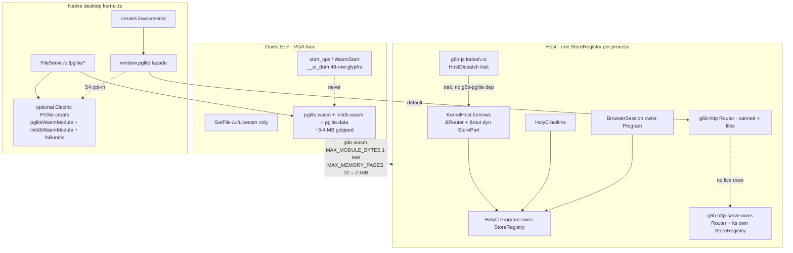
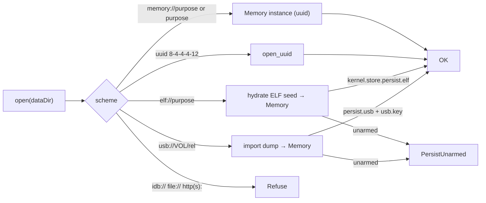
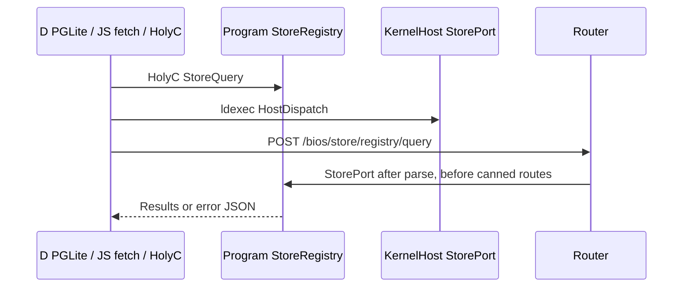

# g6b-pglite — first-party BIOS kernel structured storage

| Field | Value |
|---|---|
| **Title** | g6b-pglite: BIOS registry / structured store |
| **Author** | Etienne Cimon |
| **Date** | 2026-09-09 |
| **Status** | Living (S0 / PR1). Identity contract: [`g6b-store-instances.md`](g6b-store-instances.md) |
| **Work tree** | `E:\cva6\g6lc_bios` (git toplevel `E:\cva6`) |
| **Green command** | `python tools/g6b.py check` (then `bios-regress`; cargo at `C:\Users\etcim\.cargo\bin`) |
| **License (first-party)** | MIT |
| **Upstream PGlite TS** | Apache-2.0 (Electric SQL `package.json` / `LICENSE`), **tier-U**, never rewritten |
| **Upstream Postgres wasm** | PostgreSQL License (embedded third-party inside the dist), NOTICE verbatim |
| **Axis** | Storage (new). **Not** B92 windowing. B82–B91 web engine is landed. |

---

## Overview

The BIOS has FileServe (`/ui/*`), USB FileMgr (`/bios/files/*`), and BoardSpec settings JSON, but no **named structured store**: no parameterized query, no DDL, no transactions, no HolyC/D/JS shared registry. TempleOS/ZealOS name Adam/registry-shaped persistence as a *service*; LibreCore requires that service to be BoardSpec-gated, budgeted, and fail-closed.

This design adds crate **`g6b-pglite`**: a first-party, PostgreSQL-*shaped* in-process registry used as the **canonical** kernel store. Electric SQL PGlite (`https://github.com/electric-sql/pglite`) is cloned as submodule **`g6lc_bios/pglite`** (build input + license + API surface, **not** `kernel-spec/`, because dist bytes **will** be served). Its emscripten `pglite.wasm` + `initdb.wasm` + `pglite.data` (~3–4 MB gzipped) is an **optional native-desktop backend**, never executed by `g6b-wasm`.

HolyC (`StoreOpen` / `StoreQuery` / `StoreExec` / `StoreDrop` / `StoreExport` / `StoreImport` / …), JS `fetch("/bios/store/…")`, and libwasm D `struct PGLite` (Lodash wrap of interned `window.pglite`) all hit the **same** `StoreRegistry` owned by HolyC `Program`. **Instances are UUID-led**; **purpose** is what the BIOS UI (and later an iframe app) asks for. Memory is deletable; USB is dump import/export on the key FileMgr — see [`g6b-store-instances.md`](g6b-store-instances.md). Remote iframe pages never get it. Guest `start_ops` / 48-row `__ui_dom` stays the VGA text face.

---

## Background & Motivation

### Current state

| Surface | What exists | Gap |
|---|---|---|
| BoardSpec settings | canned JSON at `/bios/settings` (`crates/g6b-http/src/router.rs:227-273`) | not a queryable catalog |
| USB FileMgr | directory listings (`g6b-fs`, `/bios/files/{fat32,ntfs,ext4}`) | blobs, not rows |
| FileServe | static `/ui/{index.html,app.js,ui.wasm}` (`crates/g6b-http/src/files.rs:21-118`) | no `/ui/pglite/*` |
| Lodash | 12 `ldexec_*` imports; first-party backend `crates/g6b-js/src/lodash.rs`; browser host `browser-ui/src/kernel.ts` `ldexecImports()` | **no** `attempt` / `invoke`; `Eval("window.pglite")` is `EvalRefused` |
| Moment | `libwasm/source/libwasm/moment.d` — Lodash wrap of `moment` | the golden host-object pattern |
| pglite.d skeleton | `svelte-d/svelte-engine/src-d/pglite.d` | `query` only; not in BIOS `svelte-engine-ws/src-d/` (only `app.d`) |
| KernelPort | fetch / HolyC / register (`crates/g6b-wasm/src/browser.rs:13-20`) | **must not** grow a store method iframes could inherit |
| Guest WASM | `start_ops` VGA glyphs; `MAX_MODULE_BYTES = 1 MiB` (`binary.rs:37`); `MAX_MEMORY_PAGES = 32` = 2 MiB (`binary.rs:38`) | cannot decode or instantiate emscripten Postgres (module ≫ 1 MiB; Electric initial memory 2048 pages = 128 MiB) |
| Router | static JSON + files; `fetch()` zeros the body (`router.rs:441-462`); CLI `HTTP_REQUEST_LIMIT = 8192` (`g6b-cli/src/main.rs:359`) | no live `/bios/store` POST; 8 KiB cap would kill store bodies |

SQLite-in-bun is the analog: a **native** module plus `db.query` / `db.exec` / transactions. PGlite's published JS API is `PGlite.create()`, `.query(sql, params)`, `.exec(sql)`, `.sql` tagged template, `.transaction(fn)`, `.listen`/`.unlisten`, `.close()`, `.waitReady`, `dumpDataDir` / `loadDataDir`. The BIOS cannot pretend `g6b-wasm` is that runtime.

### Pain points

1. **No shared registry** for boot policy, menu state, or local-app tables that HolyC and the svelte-d UI can both mutate under budgets.
2. **pglite.d cannot run**: `defaultTo(Eval("window.pglite"))` plus `attempt("query", …)` is refused on both lodash backends today (`lodash.rs:433-440`, `kernel.ts:387-423` has no `attempt`/`invoke`).
3. **Dist wasm is not in git.** Electric's `.gitignore` lists `/packages/pglite/dist`. Docker builds land in `packages/pglite/release/`; npm `@electric-sql/pglite` is what actually ships `dist/pglite.wasm` + `dist/initdb.wasm` + `dist/pglite.data` (historically `postgres.wasm` / `postgres.data`). `include_bytes!` of a missing path breaks `cargo test`.
4. **ELF budget.** Guest `.rodata` already carries `ui.wasm` (`g6b-asm` `BIOS_UI_WASM` / optional LDC cell). Embedding 3–4 MB gzipped Postgres into every `g6lc_bios.elf` is a product decision, not a default.

---

## Goals & Non-Goals

### Goals

1. Budgeted, BoardSpec-optional **registry instances** (UUID identity, purpose allow-list) with parameterized query, exec/DDL, transactions, close, **drop**, USB **export/import**, and error JSON.
2. One catalog visible from **HolyC**, **`/bios/store/*`**, and **D `PGLite`** (Lodash family). BIOS UI is purpose-based; later iframe apps bind a uuid.
3. Submodule `g6lc_bios/pglite` + a **pin that `git submodule` cannot satisfy alone** (npm tarball SHA-256 for dist bytes).
4. Optional FileServe of `/ui/pglite/*` for the native `kernel.ts` host.
5. Iframe/capability story that names **native vs remote vs later HolyC elevation**.
6. Green `python tools/g6b.py check` (independence + bun + fmt/clippy/test, then `bios-regress`) with store tests; fixtures keep store **off** so regress is unchanged; minimal profiles still elaborate.

### Non-goals

- Not B92 windowing / tabs / iframes (that plan stays later).
- Not running emscripten Postgres inside `g6b-wasm` / guest `start_ops`.
- Not growing guest `start_ops` to `Object_Call`.
- Not a new wasm import family (`pglite_query_*`). Lodash `ldexec_*` only, unless a later PR justifies otherwise.
- Not hooking `document`/`window` in `g6b-kernel`. UI-thread Host interns `window.pglite`.
- Not Chromium, puppeteer, goja-*runtime*, SvelteKit, QEMU `-netdev`.
- Not compiling `kernel-spec/` or the PGlite TypeScript/C sources.
- Not crates.io SQL engines (`rusqlite`, `sqlparser`, `postgres`). KD0: first-party parser only (`fontdue` remains the sole allowed external crate).
- Not rebuilding LDC unless a PR explicitly sets `G6B_DUB_WASM=1`.
- Not Postgres extensions (pgvector, PostGIS), wire protocol, LISTEN/NOTIFY in v1, or tagged-template `sql` in D.
- Not IndexedDB / OPFS as kernel persistence (native-browser-only APIs; BIOS persistence is memory / ELF / USB FileMgr).

---

## Proposed Design

### Honest runtime split

Three runtimes already exist. PGlite wasm is a **browser-loaded** artifact, not guest IR.



| Runtime | Store backend | Electric wasm |
|---|---|---|
| Guest `start_ops` / `__ui_dom` | **none** | refused |
| Host `BrowserSession` / HolyC | **`g6b-pglite` only** | refused (no emscripten host; 1 MiB module cap; 2 MiB memory cap) |
| Native `kernel.ts` (real browser loading `/ui/`) | **facade → `/bios/store`** (v1); optional Electric instantiate (S4) | FileServe + their JS **verbatim**, never rewritten |

Do not pretend one runtime is the other.

### Crate `g6b-pglite`

**Path:** `g6lc_bios/crates/g6b-pglite`  
**Workspace member** in `Cargo.toml` (alongside `g6b-fs`, `g6b-http`).  
**License:** MIT, © 2026 Etienne Cimon.  
**Dependencies:** `g6b-spec` only (`g6b_spec::Json` for cells and dump — no second JSON type, no serde). No `g6b-http` (avoids a cycle); no crates.io. `g6b-js` does **not** depend on this crate.

```
crates/g6b-pglite/
  Cargo.toml
  src/
    lib.rs       // StoreRegistry, budgets, prelude
    error.rs     // StoreError → PGlite-shaped JSON
    names.rs     // store id / dataDir parse, allow-list
    sql.rs       // lexer + parser (registry SQL)
    engine.rs    // tables, rows, PRIMARY KEY uniqueness, tx
    catalog.rs   // named stores
    persist.rs   // memory (deletable) | elf seed | usb export/import — fail closed if unarmed
    results.rs   // QueryResult { rows, fields, affected_rows }
```

#### Public types

```rust
/// One BoardSpec-compiled catalog of UUID instances. See g6b-store-instances.md.
pub struct StoreRegistry {
    spec: StoreCfg,           // copy of kernel.store
    instances: BTreeMap<StoreUuid, Store>,
    current: BTreeMap<Purpose, StoreUuid>,
}

pub struct StoreUuid([u8; 16]); // RFC 4122 lowercase 8-4-4-4-12; nil refused
pub struct Purpose(String);     // ^[a-z][a-z0-9_]{0,31}$  — BIOS UI / later iframe ask this

pub struct Store {
    uuid: StoreUuid,
    purpose: Purpose,
    label: Option<String>,
    persist: PersistMode,
    tables: BTreeMap<String, Table>,
    tx: Option<Tx>,           // at most one open transaction
    handles: u32,             // close unbinds; drop deletes
}

pub enum PersistMode {
    Memory,                   // default; deletable; dies on drop or reboot
    ElfSeed,                  // hydrated from `__g6b_store_dump`; live copy is Memory
    UsbLive { volume: String, rel: String }, // reserved; v1 USB is export/import
}

pub struct QueryResult {
    pub rows: Vec<BTreeMap<String, g6b_spec::Json>>, // crates/g6b-spec/src/json.rs
    pub fields: Vec<Field>,
    pub affected_rows: u64,
}

pub struct Field { pub name: String, pub data_type_id: u32 }

pub enum StoreError {
    Disabled,
    UnknownStore,
    Closed,
    Budget(&'static str),
    Syntax(String),
    Exec(String),
    PersistUnarmed(&'static str),
    CapDenied,
    NotImplemented(&'static str),
}
```

`StoreRegistry` methods (sync — the Lodash `ldexec` path is synchronous). Identity is **uuid**; **purpose** is the BIOS-UI key. Full lifetime: [`g6b-store-instances.md`](g6b-store-instances.md).

| Method | Role |
|---|---|
| `create(purpose)` | new Memory uuid; fail if over `max_instances` / `max_per_purpose` or purpose not allow-listed |
| `open_purpose(purpose)` | get-or-create `current[purpose]` |
| `open_uuid(uuid)` | bind a handle; `UnknownStore` if dropped |
| `query(uuid, sql, params)` | one statement, `$1…$n` |
| `exec(uuid, sql)` | one or more statements, **no** parameters (PGlite contract) |
| `begin` / `commit` / `rollback` | single-level tx |
| `close(uuid)` | unbind handle; **instance stays** (reopen by uuid) |
| `drop(uuid)` | **delete** Memory instance; USB file untouched |
| `dump(uuid)` | JSON snapshot (uuid + purpose + tables; not a Postgres tar) |
| `load(uuid, blob)` | restore dump into that uuid; purpose must match; refuse tables unless `replace` |
| `export(uuid, volume, rel?)` | write dump on USB **key** FileMgr (`persist.usb`) |
| `import(volume, rel)` | read dump → Memory instance (same uuid if free) |
| `list()` | uuid + purpose + persist + row counts |

`waitReady` is a no-op success on this crate (`{ok:true,ready:true}`). Electric wasm readiness is an S4 native concern.

#### Registry SQL (PostgreSQL-shaped subset)

Not Postgres. Frozen grammar below — implement `sql.rs` from this page, do not guess. Anything else is a syntax error JSON (fail closed), never a silent subset.

**Tokens** (lexer, case-insensitive keywords, no comments in v1):

```
ident     := [A-Za-z_][A-Za-z0-9_]* | '"' { [^"] | '""' }+ '"'
int       := '-'? [0-9]+                          // i64; overflow → syntax
real      := '-'? [0-9]+ '.' [0-9]+               // f64
string    := "'" { [^'] | "''" }* "'"
param     := '$' [1-9] [0-9]*                     // $1… ; '?' is syntax error
kw        := CREATE|TABLE|IF|NOT|EXISTS|DROP|INSERT|INTO|VALUES|
             UPDATE|SET|DELETE|FROM|SELECT|WHERE|ORDER|BY|ASC|DESC|
             LIMIT|OFFSET|BEGIN|COMMIT|ROLLBACK|AND|OR|IS|NULL|
             PRIMARY|KEY|TEXT|INTEGER|REAL|BOOLEAN|JSON|SERIAL|
             COUNT|MAX|MIN|SUM|TRUE|FALSE
punct     := ( ) , . * = != <> < > <= >= ;
```

`TRUE`/`FALSE`/`NULL` are literals. **Purposes** (`names.rs`) are a separate alphabet `^[a-z][a-z0-9_]{0,31}$`, not SQL idents and not instance ids. Instance ids are UUID.

**Types:** `TEXT`, `INTEGER` (i64), `REAL` (f64), `BOOLEAN`, `JSON` (`g6b_spec::Json`). No `BLOB`/`BYTEA`. `SERIAL` ≔ `INTEGER` NOT NULL plus a per-table `i64` counter starting at 1; next value that would overflow `i64::MAX` is `Exec("serial overflow")`, not wrap.

**`PRIMARY KEY`:** at most one column per table. Implies uniqueness (insert/update that collides is `Exec("unique")`) and a lookup map in `engine.rs`. **No `CREATE INDEX`.** Extra `PRIMARY KEY` or composite keys are syntax errors.

**Value vs expr.** INSERT has no source row, so a column `ident` is meaningless there.

```
value := literal | param
expr  := value | ident
literal := string | int | real | TRUE | FALSE | NULL
```

No arithmetic, no function calls, no `col + 1`. Column `ident` is legal only on UPDATE `SET` RHS (copy that column’s current row value) and in `pred`. `INSERT … VALUES (other_col)` is a **syntax error** (PR3a test).

**Pred:**

```
pred := pred_or
pred_or  := pred_and { OR pred_and }*
pred_and := pred_not { AND pred_not }*
pred_not := [ NOT ] pred_atom
pred_atom := '(' pred ')'
           | expr ( '=' | '!=' | '<>' | '<' | '>' | '<=' | '>=' ) expr
           | expr IS [ NOT ] NULL
```

No `LIKE`, `IN`, `BETWEEN`, `JOIN`, subqueries.

**Select-list** — exactly one of:

1. `*` — expand to the table’s column order.
2. a comma-separated list of `ident` (no aliases).
3. **one** aggregate: `COUNT(*)` | `COUNT(ident)` | `MAX(ident)` | `MIN(ident)` | `SUM(ident)`. The result is one row, one column named after the function (`count` / `max` / `min` / `sum`). Mixing an aggregate with a non-aggregate, two aggregates, or `GROUP BY` is a syntax error.

**Statements:**

```
CREATE TABLE [IF NOT EXISTS] ident '(' col type [PRIMARY KEY] { ',' col type [PRIMARY KEY] }* ')'
DROP TABLE [IF EXISTS] ident
INSERT INTO ident [ '(' ident { ',' ident }* ')' ] VALUES '(' value { ',' value }* ')' { ',' '(' value { ',' value }* ')' }*
UPDATE ident SET ident '=' expr { ',' ident '=' expr }* [ WHERE pred ]
DELETE FROM ident [ WHERE pred ]
SELECT select_list FROM ident [ WHERE pred ] [ ORDER BY ident [ ASC | DESC ] ] [ LIMIT int | param ] [ OFFSET int | param ]
BEGIN | COMMIT | ROLLBACK
```

`query()` accepts **one** statement (no `;` inside except optional trailing). `exec()` accepts one or more `;`-separated statements and **no** `param` tokens (PGlite contract); any statement failure rolls the whole batch back.

**Parameters:** `$1…$n` only, 1-based, dense (using `$2` without `$1` is syntax). Bound values are a JSON **array** (`g6b_spec::Json::Arr`). Count mismatch → `Exec("bind")`.

Lodash `MAX_PARAMS = 5` (`lodash.rs:37`) counts command-buffer slots including the method name. Therefore D/HolyC **must** pass params as **one** JSON array, not variadic bound values:

```
query(sql, params_json_array)   // attempt("query", sql, "[\"opensbi\"]")
```

A fourth bound `$4` as a separate Lodash arg would trap. The array may hold up to `max_columns` values (16 default).

**`sql` tagged templates:** refused in D. **`transaction(fn)`:** refused as a JS callback; use `begin`/`commit`/`rollback` or `exec("BEGIN; …; COMMIT")`. **`listen` / `unlisten`:** `NotImplemented("listen")`. No `RETURNING`, CTEs, views, `JOIN`.

#### Budgets (fail closed)

| Knob | Default | Cap | Notes |
|---|---|---|---|
| `max_instances` | 4 | 16 | UUID instances (`max_stores` JSON alias) |
| `max_per_purpose` | 2 | 8 | BIOS UI + later iframe copies of one purpose |
| `max_tables` | 32 / store | 64 | |
| `max_columns` | 16 / table | 32 | |
| `max_rows` | 4096 / table | 16384 | |
| `max_sql_bytes` | 64 KiB | 256 KiB | |
| `max_param_bytes` | 16 KiB | 64 KiB | sum of bound values |
| `max_result_bytes` | 256 KiB | 1 MiB | serialized JSON |
| `max_tx` | 1 | 1 | no nesting |
| `max_open` | 4 | 8 | concurrent open stores |

Exceeding a budget is `StoreError::Budget`, never a realloc or silent truncate.

#### Persistence



Identity and USB verbs: [`g6b-store-instances.md`](g6b-store-instances.md).

- **Default Memory.** Volatile across reboot. **Deletable** via `drop(uuid)` without reboot. `close` only unbinds. Always available when `kernel.store.enable`.
- **`elf://`.** First-party dump JSON compiled into `__g6b_store_dump` (fixture JSON via `g6b.py store-embed` / `g6b-elf`). Hydrates a **Memory** copy (purpose from dump). Unarmed if that blob was not linked. **Independent of `pglite.embed`**.
- **USB.** Key FileMgr **export/import** of dump JSON (`StoreExport` / `StoreImport`). Default path `{volume}/stores/{purpose}/{uuid}.g6bstore`. **Not** FAT32 flash firmware. Never `file://`. `usb://VOL/rel` as `dataDir` means import, not a live mount (v1).
- **`idb://` / OPFS.** Refused on every runtime in v1. IndexedDB is not a BIOS medium; native `kernel.ts` must not silently persist operator data into the desktop browser profile.
- Fail closed: unarmed persist returns `PersistUnarmed`, does **not** fall back to memory (that would look like a successful USB save).

Dump format (first-party, versioned):

```json
{"g6b_store":1,"uuid":"550e8400-e29b-41d4-a716-446655440000","purpose":"registry","label":null,"tables":{"kv":{"cols":[...],"rows":[...]}}}
```

Not PGlite `dumpDataDir()` tar. S4 Electric wasm may dump tar **only** on the native path; HolyC `StoreDump` / USB export always emit the JSON above.

### Binding architecture (Lodash family)

pglite.d stays the Moment/Lodash family. **No new import family.**

#### Why `attempt` / `invoke` must land first

`svelte-d/svelte-engine/src-d/pglite.d` already does:

```d
m_ld.defaultTo(Eval("window.pglite"));
m_ld.attempt(args);
// ...
return m_ld.attempt("query", query, args).execute!JSON();
```

`moment.d` uses `invoke("format", …)`. Neither `g6b-js` `SUPPORTED` (`lodash.rs:455-494`) nor `kernel.ts` `lodashRun` (`kernel.ts:385-423`) implements `attempt` or `invoke`. Bare `=window.pglite` is `EvalRefused` (`lodash.rs:438-440`); `ldexec` string seeds with `evalTail` throw (`kernel.ts:447`).

#### Allow-listed intern, still no `eval`

`putEval` writes `"=window.pglite"` into the command buffer (`lodash.d:410-428`). `sigil()` today `EvalRefused`s that (`lodash.rs:436-440`). Do **not** evaluate it. Introduce `Param::HostName(String)` for a **fixed** table.

**Intern runs in `execute`, before `step` — this is the pglite.d path.** Live `defaultTo` (`lodash.rs:607-613`) calls `need()`, which only accepts `Param::Value` (`:539-546`). `Lodash()` is a handle init, not `VarType.eval`, so an eval-seed allow-list in `run_lodash` does **not** intern `window.pglite` for `initArgs`. If `HostName` survives into `defaultTo`, `acc` never becomes `StoreFactory`.

Algorithm:

1. Parse: allow-listed `=window.pglite` → `Param::HostName`; `=window.alert` → `EvalRefused` at parse (never a JS eval).
2. At the start of `execute` (and again before each `Command::Local` insert), walk every `Param::HostName`: `host.intern_name(name)` → replace with `Param::Value(JsValue::Handle(factory))`. `host == None` → `UnsupportedMethod` / `EvalRefused`.
3. Then `step`. `defaultTo` sees `Param::Value(Handle)` and today’s `need()` stays.
4. `attempt`/`invoke` then see a `StoreFactory` / `Store` accumulator.

Eval-seed special-case for `window.pglite` in `run_lodash` is **optional extra** (mirrors `__svelteD.ts`); it is not the intern path `pglite.d` uses. Unit test: chain `defaultTo(=window.pglite)` + `attempt("query", sql, "[]")` with a `HostDispatch` stub succeeds; `defaultTo(=window.alert)` is still `EvalRefused`.

Parse table:

| Eval / `=name` payload | Parse | Host meaning |
|---|---|---|
| `undefined` / `null` / `true` / `false` / number | value | already decoded |
| five iteratee boilerplates / `cb` | Callback | guest dispatch (landed) |
| `window.pglite` | `HostName` | interned **`ObjectKind::StoreFactory`** handle |
| `moment` / `window.moment` | `HostName` | existing Moment intern (when that lane is live) |
| `window.__svelteD.ts` | already special-cased as eval seed in `run_lodash` | JsExports intern |
| anything else (`window.alert`, …) | **`EvalRefused`** | |

`KernelHost::run_lodash` (`g6b-kernel/src/lib.rs:2272-2306`) already special-cases the eval **seed** `window.__svelteD.ts`. Intern of `pglite` for D is **`HostDispatch::intern_name` during `execute`**, plus **`libwasm_global`** (`lib.rs:2627-2641`: today only `window`/`document`/`console` via `ensure_js_globals`), gated on `spec.kernel.store.enable`; otherwise return **0**. Do **not** add `"pglite"` to `JsExports::is_browser_global` (that helper is DOM-only and KernelHost does not even call it).

`g6b-wasm` `ObjectKind` (`values.rs:20-39`) gains **`StoreFactory` and `Store`**. After `attempt(dataDir)` the accumulator is `ObjectKind::Store` or later `invoke("query")` has no typed kind.

Native `kernel.ts`: `createBrowserContext` `BINDINGS` is only `{console, window, document}` (`kernel.ts:1257-1271`). `libwasm_global` uses `ctx.global(name)`. Plant `pglite` on **shell** `BINDINGS` only (and on a registered-app context that declared `bios.store`). Nested iframe contexts do not copy it. Test: nested `createBrowserContext.global("pglite")` is `undefined`. **Do not** assign `window.pglite` on the real DOM `window` (same-origin scripts / future B92 `<iframe>` would see it; BINDINGS isolation does not cover that).

#### `HostDispatch` — who calls `StoreRegistry`

`g6b-js` depends only on `g6b-dom` + `g6b-webidl`. Putting `StoreRegistry` in `lodash.rs` would pull `g6b-pglite` into `g6b-js`. Putting dispatch only in `kernel.ts` leaves BrowserSession dark. Moment already emits `attempt`/`invoke`; a store-only implementation must **not** become general `acc[name](...args)` (High threat).

Add a trait **next to `Iteratee`** in `lodash.rs`. `g6b-js` stays store-ignorant:

```rust
pub trait HostDispatch {
    fn intern_name(&mut self, name: &str) -> Result<JsValue, LodashError>;
    fn attempt(&mut self, acc: &JsValue, params: &[Param]) -> Result<JsValue, LodashError>;
    fn invoke(&mut self, acc: &JsValue, path: &str, params: &[Param]) -> Result<JsValue, LodashError>;
}

pub fn execute(
    init: JsValue,
    commands: &[Command],
    cb: Option<&mut dyn Iteratee>,
    host: Option<&mut dyn HostDispatch>,
) -> R<JsValue>
// first: rewrite Param::HostName via host.intern_name (else EvalRefused)
// then: step (defaultTo/need sees Value; attempt/invoke see StoreFactory/Store)
```

`attempt`/`invoke` with `host == None` → `UnsupportedMethod`. With a host: if `acc` is not a store factory/instance identity, **`UnsupportedMethod`** (fail closed; no DOM invoke). `KernelHost` implements `HostDispatch` against `&mut dyn StorePort` (see ownership). Pattern matches existing `invoke_export` intercept in `run_lodash` (`lib.rs:2299-2304`) — store dispatch is a second intercept, not a lodash.rs dependency.

| Accumulator | Command | Meaning |
|---|---|---|
| Store **factory** | `attempt()` / `attempt(undefined)` | `open` default store (`registry`) → `ObjectKind::Store` handle |
| Store factory | `attempt(dataDir_string)` | `open_purpose` / `open_uuid` / import — see instances doc |
| Store **instance** | `attempt("query", sql, params_json)` | `query`; params are **one** JSON array string |
| Store instance | `invoke("query"\|"exec"\|"close"\|…, …)` | method dispatch |
| anything else | `attempt` / `invoke` | `UnsupportedMethod` |

Native `kernel.ts` `lodashRun`: same identity check on the interned BINDINGS handle. If the facade would return a **Promise**, refuse with error JSON `{ok:false,error:"async",message:"NotImplemented(\"async\")}` — never pass a Promise into `execute!JSON()`. S3 is **BrowserSession-complete**, not native-D-complete.

#### `window.pglite` facade (native `kernel.ts`)

Planted only when `kernel.store.enable`. Shape matches the D wrap:

```js
function installPglite(fetchFn, spec, ctx) {
  if (!spec.store?.enable) return;
  const facade = function PgLiteFactory(dataDir) {
    return new BiosStore(fetchFn, dataDir || "registry");
  };
  facade.query = (...a) => facade().query(...a);
  // D intern: shell BINDINGS only (libwasm_global / ctx.global).
  if (ctx && ctx.contextId === "main") ctx.bind("pglite", facade);
  // lang=ts: module-local export, not real DOM window.pglite.
  return facade;
}
export const pglite = /* shell-only */ undefined; // set from installPglite when contextId==="main"
```

class BiosStore {
  constructor(fetchFn, dataDir) { this.fetchFn = fetchFn; this.dataDir = String(dataDir || "registry"); }
  query(sql, paramsJson) { return this.post("query", { sql, params: JSON.parse(paramsJson || "[]") }); }
  exec(sql) { return this.post("exec", { sql }); }
  begin() { return this.post("begin", {}); }
  commit() { return this.post("commit", {}); }
  rollback() { return this.post("rollback", {}); }
  close() { return this.post("close", {}); }
  waitReady() { return { ok: true, ready: true }; }
  dump() { return this.get("dump"); }
  load(body) { return this.put("load", body); }
  post(op, body) { /* POST /bios/store/{id}/{op} — sync via KernelPort fetch in-host;
                     native browser: fetch, but ldexec cannot await; see S4 */ }
}
```

**Decided (was Open Question 1):** S3 D wrap is live on **BrowserSession** (`HostDispatch` → `StorePort` → `StoreRegistry`, sync). Native `kernel.ts` plants the interned factory on shell BINDINGS and implements `attempt`/`invoke` identity-checked; any Promise-returning path is `NotImplemented("async")`. lang=ts `App.svelte` may `await fetch("/bios/store/…")` (async). Native D `execute!JSON` is **not** S3-complete. `Atomics`/`SharedArrayBuffer` are refused. S5+ may add `queryAsync` via existing libwasm await (B68); this series does not.

S4 (optional Electric): after FileServe bytes are live,

```js
PGlite.create({
  pgliteWasmModule: await WebAssembly.compileStreaming(fetch("/ui/pglite/pglite.wasm")),
  initdbWasmModule: await WebAssembly.compileStreaming(fetch("/ui/pglite/initdb.wasm")),
  fsBundle: await fetch("/ui/pglite/pglite.data").then(r => r.blob()),
  dataDir: "memory://",
})
```

That object is `window.pgliteWasm`, **not** `window.pglite`. lang=ts may `await` it. D lodash does not. Electric ≥0.4 **requires** `initdb.wasm`; omitting it will not instantiate 0.5.8.

### FileServe + dist pin

#### Submodule (sources, tier-U)

```
# E:\cva6\.gitmodules
[submodule "g6lc_bios/pglite"]
    path = g6lc_bios/pglite
    url = https://github.com/etcimon/pglite.git
    branch = main
```

- **Path `g6lc_bios/pglite`**, sibling of `g6lc_bios/libwasm`, **not** `kernel-spec/` — dist wasm will be served.
- Pin git rev in `g6lc_bios/pins.toml` to the tag that matches the npm version.
- **Never rewrite** their files (E-UPSTREAMWRITE). NOTICE / LICENSE stay verbatim.
- Not a Cargo member. `tools/check_independence.py` already skips `kernel-spec`; add `pglite` to `_SKIP` (or rely on it having no `Cargo.toml` we parse — still skip by name to be safe).
- Do not `pnpm build:all` / Docker wasm in the BIOS green path.

#### Dist bytes are npm-only

Verified: Electric `.gitignore` contains `/packages/pglite/dist`. README: Docker wasm → `packages/pglite/release/`; TS build produces `dist/`. GitHub comments after merge offer “Interim build files”; that is **not** a reproducible pin.

**Pin that `git submodule` cannot fetch:**

```toml
# g6lc_bios/pins.toml
[pglite]
role = "build-input"
url = "https://github.com/etcimon/pglite.git"
rev = "<git commit>"
branch = "main"
path = "pglite"
license = "Apache-2.0"
note = "Fork of electric-sql/pglite origin/main. TS client Apache-2.0; Postgres wasm inside dist is PostgreSQL License (NOTICE). Never rewritten. Never a crate."

[pglite.dist]
npm = "@electric-sql/pglite"
version = "0.5.8"          # match package.json at pinned rev
tarball = "https://registry.npmjs.org/@electric-sql/pglite/-/pglite-0.5.8.tgz"
sha256 = "<fill at pin time>"
# names inside the tarball package/dist/ — verify at fetch:
wasm = "pglite.wasm"       # was postgres.wasm on older tags
initdb = "initdb.wasm"     # required since Electric v0.4 / 0.5.8
data = "pglite.data"
js = "index.js"            # served verbatim if kernel.store.pglite.js
```

`python tools/g6b.py pglite-dist` (new subcommand) downloads the tarball into **gitignored** `g6lc_bios/.tools/pglite-dist/`, verifies SHA-256, extracts the **four** files (`pglite.wasm`, `initdb.wasm`, `pglite.data`, `index.js`). Analogous to `G6B_DUB_WASM=1` for the LDC cell: **absent bytes are empty, not a compile error**, unless the BoardSpec **asks** for them (`pglite.embed`). `check_independence.py` `_SKIP` **must** include `pglite` by name (today: `.git, target, .tools, out, __pycache__, kernel-spec`).

#### FileServe paths

`files::mount` (`crates/g6b-http/src/files.rs`) grows a gated branch:

| Path | Type | Gate |
|---|---|---|
| `{root}/pglite/pglite.wasm` | `application/wasm` | `kernel.store.pglite.files` ∧ bytes live |
| `{root}/pglite/initdb.wasm` | `application/wasm` | same (Electric ≥0.4) |
| `{root}/pglite/pglite.data` | `application/octet-stream` | same |
| `{root}/pglite/index.js` | `application/javascript` | `kernel.store.pglite.js` ∧ bytes live |

Default `root=/ui` → `/ui/pglite/*`. Listing `/bios/www` includes them when mounted.

**Do not** `include_bytes!` these from a repo path that is empty on a fresh clone. Pattern:

```rust
pub fn pglite_wasm() -> &'static [u8] {
    // include_bytes of a committed *placeholder* (empty) OR
    // cfg-gated include of .tools/ — prefer runtime read in mount()
    // so cargo test does not depend on npm.
}
```

`mount()` reads `g6lc_bios/.tools/pglite-dist/` via `std::fs` when the gate is on **and** the files exist and match the pinned SHA-256 sidecar. Missing + `pglite.files` on → **`BoardSpec::check` still passes** (flag-to-flag only, like `files.wasm` needing `kernel.wasm.enable`, not bytes on disk — `lib.rs:1302-1303`); **serve time** omits the paths and `/bios/features` reports `store_pglite_files=false` (live). Missing dist + `pglite.embed` → **ELF/link error** in `g6b-elf` / `g6b.py elf` (PR8), not spec parse. Missing dump + `persist.elf` → **ELF/link error or `PersistUnarmed` at open**, not `check()`.

**Host vs guest listing (do not conflate):**

- Host `files::mount` (`files.rs`) **runtime-reads** `.tools/pglite-dist/` for `g6b http-serve` / BrowserSession FileServe when `pglite.files` and bytes live. Never `include_bytes!` `.tools/`.
- Guest UART `File` / G6UI `nfiles` uses the **hardcoded** `ui_file_paths` in `g6b-asm/src/analyze.rs:3601-3612` (`/ui/index.html|app.js|ui.wasm` only). **Do not** share `mount()` into ELF compile — that would bake host `.tools/` bytes into every ELF despite `embed=false`.
- Guest `ui_file_paths` grows `/ui/pglite/*` **only** when `pglite.embed` (bytes already in `.rodata`). `GetFile` / UART `G` stays `GET /ui/ui.wasm`.

#### ELF embed (opt-in, default off) — Electric wasm, not registry dump

`kernel.store.pglite.embed` copies dist **`pglite.wasm` + `initdb.wasm` + `pglite.data`** into `.rodata` (`__pglite_wasm`, `__pglite_initdb`, `__pglite_data`) next to `__ui_wasm`.

| Budget | Value |
|---|---|
| `MAX_PGLITE_EMBED_BYTES` | 16 MiB combined uncompressed (wasm + initdb + data) |
| gzipped expected | 3–4 MB wasm+data plus initdb (Electric claim 3.7 MB gzipped for the client) |
| Default profiles | **embed = false** |

First-party **registry dump** is a different blob: `__g6b_store_dump`, produced by `g6b.py store-embed` from fixture JSON, gated by `kernel.store.persist.elf`. Size ≤ `max_result_bytes`. It does **not** require `pglite.embed`.

`g6b-elf` / `g6b-asm` `Module` gains optional extra rodata; `payload_memsz` accounts for it. QEMU argv **still has no `-netdev`**. This is payload size, not a NIC.

### BoardSpec gates

New optional struct on `Kernel` (`crates/g6b-spec/src/lib.rs`). Defaults all-false so **embedded/router still elaborate**.

```rust
pub struct StoreCfg {
    pub enable: bool,
    pub persist_memory: bool,         // Default true even when enable=false (harmless)
    pub persist_elf: bool,            // first-party dump blob; NOT pglite.embed
    pub persist_usb: bool,
    pub pglite_files: bool,
    pub pglite_js: bool,
    pub pglite_embed: bool,           // Electric wasm+initdb+data .rodata
    pub max_stores: u32,
    pub max_tables: u32,
    pub max_columns: u32,
    pub max_rows: u32,
    pub max_sql_bytes: u32,
    pub max_param_bytes: u32,
    pub max_result_bytes: u32,
    pub max_tx: u32,                  // must be 1
    pub max_open: u32,
    pub max_per_purpose: u32,
    pub purposes: Vec<String>,        // empty in Default; filled by apply_store; JSON `names` alias
}

impl Default for StoreCfg { /* enable=false; persist_memory=true; all other persist/pglite false;
    max_stores/max_instances=4, max_per_purpose=2, max_tables=32, max_columns=16, max_rows=4096,
    max_sql_bytes=64KiB, max_param_bytes=16KiB, max_result_bytes=256KiB,
    max_tx=1, max_open=4, purposes=vec![] */ }
```

JSON overlay (`apply_store`, sibling of `apply_http_files` at `lib.rs:2194`). Nested JSON maps onto the flat Rust fields:

```json
"kernel": {
  "store": {
    "enable": true,
    "persist": { "memory": true, "elf": false, "usb": false },
    "pglite": { "files": false, "js": false, "embed": false },
    "max_stores": 4,
    "max_tables": 32,
    "max_columns": 16,
    "max_rows": 4096,
    "max_sql_bytes": 65536,
    "max_param_bytes": 16384,
    "max_result_bytes": 262144,
    "max_tx": 1,
    "max_open": 4,
    "max_per_purpose": 2,
    "purposes": ["registry"]
  }
}
```

`apply_store` rules:

- If `enable` becomes true and `purposes` is empty after overlay, **fill `["registry"]`** before `check()`. JSON `names` is an alias for `purposes` (PR2).
- Map `persist.memory|elf|usb` → `persist_*`; `pglite.files|js|embed` → `pglite_*`. `max_stores` aliases `max_instances`.
- Unknown keys under `store` are ignored at parse (JSON overlay style); schema forbids them.

`check()` additions — **flag-to-flag only**. `BoardSpec::check()` (`lib.rs:1077+`) must not `std::fs` and must not make `cargo test -p g6b-spec` host-layout dependent. `{persist:{elf:true}}` overlays used only at ELF build stay green at spec parse.

- **`store.enable` stands alone.** UART-only HolyC may `StoreOpen` with HTTP compiled out. HTTP **routes** `/bios/store` additionally require `kernel.http.enable`. FileServe pglite bytes still require `http.files`. HolyC `STORE-REFUSED` when `!store.enable`, not when HTTP is off.
- `pglite.files` needs `store.enable` ∧ `http.files.enable` ∧ `http.files.wasm`.
- `pglite.js` needs `pglite.files` ∧ `http.files.js`.
- `pglite.embed` needs **`store.enable` only** (not `pglite.files` — embed is ELF `.rodata`, UART `File` can list via `ui_file_paths` without HTTP). Dist bytes are a **link-time** requirement (PR8 / `g6b.py elf`), not `check()`.
- `persist.usb` needs `store.enable` ∧ `kernel.usb.key`.
- `persist.elf` needs **`store.enable` only**. **Does not** require `pglite.embed`. Dump blob presence is link-time / `PersistUnarmed` at `open`, not `check()`.
- After `apply_store` fill: `enable` ⇒ `1..=max_instances` purposes, each `^[a-z][a-z0-9_]{0,31}$`.
- Every budget knob within the caps table (`max_tx` must be 1).
- `kernel.ui=sveltekit` remains refused (unchanged).

Byte presence (not `check()`):

| Gate on + bytes missing | Where it fails |
|---|---|
| `pglite.files` | serve-time omit; `store_pglite_files=false` |
| `pglite.embed` | `g6b-elf` / `g6b.py elf` link error |
| `persist.elf` | link error if `store-embed` requested; else `PersistUnarmed` at `StoreOpen("elf://…")` |

Profiles: **all default store off**, including `desktop`/`full`. JSON overlay wins. `/bios/features` grows `store`, `store_persist_{memory,elf,usb}`, `store_pglite_{files,js,embed}`.

Schema: `schemas/board-spec.schema.json` adds `kernel.store` with `additionalProperties: false` on **the store object** (same local rule as `tasking`). The parent `kernel` object stays open (`http`/`usb`/`settings` are already omitted from the sketch); adding store does not close them.

### Router endpoints (`/bios/store/…`)

`Router` today is a canned JSON map plus files (`handle` at `router.rs:367-386`). Store mutations need **live state** and **request bodies**. `Router` is `Clone`; do **not** put `StoreRegistry` inside it as a trait object.



**Single owner per process.** Live `Program` (`g6b-holyc`) owns `router: Router` and `builtin()` (`lib.rs:677+`); `g6b-holyc` has no `g6b-spec` dep today. `BrowserSession` (`g6b-kernel/src/lib.rs:3102`) owns `program` + `spec`. `g6b http-serve` (`g6b-cli/src/main.rs:318-356`) constructs a **stateless** `Router::from_spec` and never a `BrowserSession`. `KernelHost` borrows `router: &'a Router` immutably (`lib.rs:48,571`). Two owners would mean two catalogs; http-serve with no owner means POST has nowhere to put rows.

- **`StoreRegistry` lives on `Program`.** `g6b-holyc` gains `g6b-pglite`. BrowserSession shares it via `program`. HolyC `Store*` in `builtin()` sees the same map.
- **`http-serve` constructs one `StoreRegistry` beside the `Router`** and threads `&mut dyn StorePort` into `handle_http_conn`.
- **`KernelHost::attach` takes `&'a mut dyn StorePort`** in addition to `&'a Router` so lodash can mutate without storing the registry inside `Router` (keep that non-goal).

**Seam:** `StorePort` trait in `g6b-pglite` (not on `KernelPort`):

```rust
pub trait StorePort {
    fn handle(&mut self, method: &str, path: &str, body: &[u8]) -> Result<(u16, String), String>;
}
```

`Program` and the http-serve-owned registry implement it. `Router::fetch` grows `fetch_with_body`. HTTP serve threads the port after parse, **before** static routes, for paths under `/bios/store`.

**CLI 8 KiB cap (PR4, critical).** Live `HTTP_REQUEST_LIMIT = 8192` (`g6b-cli/src/main.rs:359`, `FILE-SERVER.md:78`) would reject store POST/PUT as `"request exceeds 8192 bytes"` long before store JSON 413. Path-gate it:

- Paths **not** `/bios/store/*`: keep **8192**, reject chunked, 1 s deadline (unchanged).
- Paths `/bios/store/*` when `store.enable`: limit = `max(max_sql_bytes + max_param_bytes, max_result_bytes) + 1024` (headers), i.e. default ~257 KiB, cap ~1 MiB + 1 KiB. Still reject chunked. 413 after **store** budgets, not the transport cap.
- Test: a **9 KiB** `POST /bios/store/{uuid}/query` body is 200 or store-budget 413, never `"request exceeds 8192 bytes"`.
- Document the path-gated cap in `FILE-SERVER.md`. BrowserSession lodash and HolyC builtins bypass HTTP and are unaffected; native `kernel.ts` / `http-serve` are not.

| Method | Path | Body | Result |
|---|---|---|---|
| GET | `/bios/store` | — | `{enable, purposes, budgets, persist, instances:[{uuid,purpose,persist,rows}]}` |
| GET | `/bios/store/purpose/{purpose}` | — | current instance or 404 |
| POST | `/bios/store` | `{purpose}` | create Memory `{ok,uuid,purpose}` |
| DELETE | `/bios/store/{uuid}` | — | `drop` (deletable memory) |
| POST | `/bios/store/{uuid}/export` | `{volume, rel?}` | USB key dump |
| POST | `/bios/store/import` | `{volume, rel, replace?}` | Memory instance |
| POST | `/bios/store/{uuid}/open` | `{dataDir?}` | `{ok,uuid,ready}` |
| POST | `/bios/store/{uuid}/query` | `{sql, params:[]}` | PGlite-shaped `{rows,fields,affectedRows}` |
| POST | `/bios/store/{uuid}/exec` | `{sql}` | `{results:[…]}` |
| POST | `/bios/store/{uuid}/begin` | `{}` | `{ok}` |
| POST | `/bios/store/{uuid}/commit` | `{}` | `{ok}` |
| POST | `/bios/store/{uuid}/rollback` | `{}` | `{ok}` |
| POST | `/bios/store/{uuid}/close` | `{}` | unbind `{ok}` |
| GET | `/bios/store/{uuid}/dump` | — | dump JSON |
| PUT | `/bios/store/{uuid}/load` | dump JSON | `{ok}` |

Unknown `{id}` → 404. Disabled (`!store.enable` **or** HTTP off for the HTTP face) → 404 `{error:"not found"}` (do not advertise). Cap denied → 403 `{error:"cap"}`. Body > `max_sql_bytes + max_param_bytes` (query/exec) or `max_result_bytes` (load) → **413 store JSON**, after the path-gated transport cap has already accepted the bytes.

`g6b-ui::setup_reads` adds `/bios/store` **only** when `store.enable` (shell allow-list). Iframe sessions do **not** reuse `setup_reads` (`plan-iframe.md` §6.3).

Error / success JSON (both backends, so `execute!JSON()` is stable):

```json
{"ok":true,"rows":[{"k":"boot.next","v":"opensbi"}],"fields":[{"name":"k","dataTypeID":25},{"name":"v","dataTypeID":25}],"affectedRows":0,"ready":true}
{"ok":false,"error":"syntax","message":"JOIN refused","sqlstate":"42601"}
{"ok":false,"error":"budget","message":"max_rows"}
{"ok":false,"error":"persist","message":"usb unarmed"}
{"ok":false,"error":"cap","message":"bios.store denied"}
```

`dataTypeID` uses Postgres text=25, int4=23, float8=701, bool=16, json=114 so a later Electric swap does not change D field poking.

### HolyC builtins

`crates/g6b-holyc/src/lib.rs` `legacy_builtin_name` / `builtin()` (`:416-453`, `:677+`). Same router table as JS. New names (do not overload `KernelGet`):

| Builtin | Args | Behaviour |
|---|---|---|
| `StoreOpen` | purpose [, dataDir] | get-or-create current; print `STORE-OPEN {uuid} {purpose}` |
| `StoreSelect` | purpose, uuid | set current |
| `StoreClose` | uuid | unbind; `STORE-CLOSE {uuid}` |
| `StoreDrop` | uuid | delete Memory; `STORE-DROP {uuid}` |
| `StoreQuery` | uuid-or-purpose, sql [, params_json] | `STORE-QUERY 200 {json}` |
| `StoreExec` | uuid-or-purpose, sql | `STORE-EXEC 200 {json}` |
| `StoreBegin` / `StoreCommit` / `StoreRollback` | uuid-or-purpose | `STORE-TX …` |
| `StoreDump` | uuid | dump JSON (bounded) |
| `StoreLoad` | uuid, json | load |
| `StoreExport` | uuid, volume [, rel] | USB key dump; `STORE-EXPORT {uuid}` |
| `StoreImport` | volume, rel | `STORE-IMPORT {uuid}` |
| `StoreList` | — | uuid + purpose + persist + rows |

Disabled store (`!kernel.store.enable`): `STORE-REFUSED` (fail closed), never a fake empty table. HTTP compiled out does **not** refuse HolyC `Store*` — UART dual-band REPL is a separate face (`KERNEL-API.md` is “same table”, not “HTTP must be compiled”). Instruction/output budgets already on `Program` apply. `RegisterEndpoint` remains the way to add *custom* HTTP; store is kernel-owned, not a HolyC-registered canned body.

UART/mbox: no new single-letter command in v1 (avoid colliding `S`/`Q`). Operators use the HolyC REPL / dual-band. Optional later: `Store` lists like `File`.

### Extended `pglite.d`

Promote the wrap into libwasm (Moment’s home) and keep the engine golden as a re-export.

| File | Role |
|---|---|
| `libwasm/source/libwasm/pglite.d` | `module libwasm.pglite`; public-imported from `package.d` |
| `svelte-d/svelte-engine/src-d/pglite.d` | passthrough `public import libwasm.pglite;` (or keep identical body until the libwasm PR lands) |
| `browser-ui/svelte-engine-ws/src-d/` | drop-ws still prints App only; **do not** require a ws copy. `import libwasm;` is enough once package.d exports it |

Do **not** rebuild LDC unless `G6B_DUB_WASM=1`.

```d
module libwasm.pglite;
import libwasm.types;
import libwasm.lodash;
import std.traits;
nothrow: @safe:

PGLite PgLite() { return PGLite().initArgs(Eval("undefined")); }
PGLite pgliteHandle(Handle handle) { return PGLite().initHandle(handle); }
PGLite pgliteHandle(T)(ref T handle) if (is(T : JsHandle)) {
    return PGLite().initHandle(handle.handle);
}
PGLite PgLite(ARGS...)(auto ref ARGS args) if (ARGS.length > 0) {
    return PGLite().initArgs(args);
}

struct PGLite {
    private Lodash m_ld;
    private Handle m_saved;
    private bool m_dirty;

    private PGLite initHandle(Handle h) {
        m_ld = Lodash(h, VarType.handle, 1024);
        return this;
    }
    private PGLite initArgs(ARGS...)(auto ref ARGS args) {
        m_ld = Lodash();
        m_ld.defaultTo(Eval("window.pglite"));
        m_ld.attempt(args);
        return this;
    }

    Handle save()(bool drop_previous = true) { /* same as moment.d */ }

    JSON query()(string sql, string params_json = "[]") {
        save();
        // one JSON array: lodash MAX_PARAMS=5 cannot carry variadic $1..$n
        return m_ld.attempt("query", sql, params_json).execute!JSON();
    }
    JSON exec()(string sql) {
        save();
        return m_ld.invoke("exec", sql).execute!JSON();
    }
    JSON begin()()  { save(); return m_ld.invoke("begin").execute!JSON(); }
    JSON commit()() { save(); return m_ld.invoke("commit").execute!JSON(); }
    JSON rollback()() { save(); return m_ld.invoke("rollback").execute!JSON(); }
    JSON close()() {
        save();
        auto j = m_ld.invoke("close").execute!JSON();
        m_saved = 0; m_dirty = true;
        return j;
    }
    JSON waitReady()() {
        save();
        return m_ld.invoke("waitReady").execute!JSON();
    }
    JSON dump()() { save(); return m_ld.invoke("dump").execute!JSON(); }
    JSON load()(string json) { save(); return m_ld.invoke("load", json).execute!JSON(); }
    JSON errorOf()(ref JSON j) { /* poke j["error"] — optional helper */ return j; }
}
```

**Picked / refused**

| PGlite JS API | g6b-pglite / pglite.d | Why |
|---|---|---|
| `PGlite.create()` / ctor | `PgLite()` / `PgLite(dataDir)` | factory via `attempt(args)` |
| `.query(sql, params)` | **implement** as `query(sql, params_json_array)` | one Lodash param; `$1…$n` inside the engine |
| `.exec(sql)` | **implement** | DDL / multi-statement |
| `.sql` tagged template | **refuse** | no JS templates on the command buffer |
| `.transaction(fn)` | **refuse callback**; `begin`/`commit`/`rollback` + `exec` batch | D delegates are Lodash iteratees, not tx callbacks |
| `.listen` / `.unlisten` | **refuse v1** | no NOTIFY engine; error JSON |
| `.close()` | **implement** | |
| `.waitReady` | **implement** as sync `{ready:true}` | first-party is sync; Electric stays off this path |
| `dumpDataDir` / `loadDataDir` | **implement** as JSON dump/load | USB/ELF persist; not Postgres tar |
| named `dataDir` | **implement** | purpose / uuid / `memory://` / `usb://` import / `elf://` seed — [`g6b-store-instances.md`](g6b-store-instances.md) |
| extensions, wire protocol | **refuse** | |

Keep Lodash command-buffer style. Methods that need a saved instance call `save()` first (Moment pattern).

### Iframe / capability

From `architecture/plan-iframe.md` §6.3–6.4. Store is **native**.

| Origin | `bios.store` |
|---|---|
| Shell (BIOS UI `WasmUi`, not an iframe) | **yes**, when `kernel.store.enable` |
| Registered local app (`app:files`, `app:ssh`, BoardSpec hook) | **only if the hook declares `bios.store`** |
| Local `/ui/*.html`, `srcdoc`, `about:blank` | **no** |
| Local `/ui/*.wasm` nested cell | **no** by default; verifier rejects a store intern unless registered or later elevation |
| Remote `http(s):` | **never**. No elevation. Outbound fetch ≠ KernelPort ≠ store |

`pglite` is interned only on the shell `createBrowserContext` BINDINGS (and on a registered app context that declared the cap). A nested `createBrowserContext` does **not** copy it; `global("pglite")` is `undefined` and `libwasm_global("pglite")` returns 0. Do **not** assign `window.pglite` on the real DOM window. lang=ts uses a module-local export after `contextId === "main"`. When B92 real `<iframe>`s exist, do not copy the property into nested browsing contexts.

Later HolyC elevation (`plan-iframe.md` §6.4): catalog name **`bios.store`**. `ElevateAsk("bios.store", origin, persistence?)`. A grant may name a **purpose**, not the whole catalog. Remote origins cannot ask. v1 of B92 does not implement the prompt; v1 of **this** axis is fail-closed the same way. Persistence of **grants** is undetermined; store **data** is UUID Memory + USB export/import ([`g6b-store-instances.md`](g6b-store-instances.md) §7), not a grant.

Do **not** add `store_query` to `KernelPort`. That trait is fetch / HolyC / register. Reusing it would leak store to any cell that already has KernelPort.

### Guest ELF / `start_ops`

Unchanged. `g6b-wasm::jit::start_ops` stays the MVP encoder VGA face (`jit.rs:641`). B91 already forbids growing it to `Object_Call`. PGlite wasm is not an import on that module. `__ui_dom` is not a row store. `g6b-wasm` also cannot run Electric because `MAX_MEMORY_PAGES = 32` (2 MiB) ≪ Electric’s 2048-page / 128 MiB initial memory.

### Verification (`g6b.py check`)

`tools/g6b.py` `check` runs `cmd_check` then `cmd_regress` (`:232-237`). Green is independence + bun browser-ui test/build + fmt + clippy `-D warnings` + `cargo test --workspace` **then bios-regress**. Fixtures keep `store.enable` off, so regress is unchanged; do not add store to regress fixtures in this series.

S3 green tests are **Rust lodash intern + HolyC/HTTP**, not the LDC cell. PR7 does not set `G6B_DUB_WASM=1`; `bun run build` will not compile `libwasm.pglite` into the live cell. Keep `svelte-engine-ws/src-d/` free of `pglite.d` (drop-ws still only `app.d`).

New tests (crate-local, no QEMU, no `-netdev`):

| Test | Asserts |
|---|---|
| `g6b-spec` store default off on `embedded` / `g6lc32-router.json` | no routes, no files |
| `enable: true` without `purposes` → `apply_store` fills `["registry"]`; `check()` ok | |
| `check()` is flag-to-flag: `persist.usb` without `usb.key`; `pglite.files` without `http.files`; `enable` + empty purposes filled; `{persist:{elf:true}}` parses without a dump file; `pglite.embed` without `pglite.files` is legal; bad purposes | |
| `g6b-pglite` CREATE/INSERT/SELECT `$1`; UPDATE/DELETE; BEGIN/COMMIT/ROLLBACK; `SELECT *`; `COUNT(*)` | |
| `SELECT COUNT(x), y`; JOIN; `?`; listen; nested tx; arithmetic SET; `INSERT … VALUES (other_col)`; oversize SQL → error JSON | |
| persist usb/elf unarmed → `PersistUnarmed`, not memory fallback | |
| `drop(uuid)` removes from `list`; `close` does not | |
| USB export to `flash` refused; import restores dump uuid when free | |
| max_rows insert 4097 → `Budget` | |
| `g6b-http` mount: store off → no `/ui/pglite/*`; on + missing dist → no paths, features flag false | |
| `Router` 404 `/bios/store` when disabled; 200 listing when enabled | |
| http-serve 9 KiB `POST /bios/store/…/query` is not `"request exceeds 8192 bytes"` | |
| HolyC `StoreQuery` with HTTP off and `store.enable` → works; `!store.enable` → `STORE-REFUSED` | |
| lodash `defaultTo(=window.pglite)` then `attempt("query", sql, "[]")` with `HostDispatch` stub; `defaultTo(=window.alert)` still `EvalRefused`; Promise path → `async` error; nested `createBrowserContext.global("pglite")` is `undefined` | |
| `check_independence`: `pglite/` in `_SKIP`; no crates.io SQL | |
| start_ops / `MAX_MODULE_BYTES` / `MAX_MEMORY_PAGES` tests unchanged | |

Host BrowserSession integration: open default store, `query`, paint a row into DOM (optional, not a QEMU pin).

---

## API / Interface Changes

### Before

- No `kernel.store`.
- No `/bios/store`.
- `KernelPort` = fetch / holyc / register.
- Lodash SUPPORTED ends at `countBy`.
- `pglite.d` skeleton unused.

### After

- `kernel.store` optional on BoardSpec / schema / `/bios/features`.
- Live `/bios/store/{id}/{op}` via `StorePort` on `Program` (http-serve owns a sibling registry); path-gated HTTP body cap.
- HolyC `Store*` builtins (no HTTP required).
- Lodash `HostDispatch` + `attempt` / `invoke` + intern allow-list; `ObjectKind::StoreFactory` and `Store`.
- `pglite` interned on shell `createBrowserContext` BINDINGS + `libwasm_global`, not `is_browser_global`, not the kernel type table.
- `libwasm.pglite.PGLite` methods listed above.
- FileServe `/ui/pglite/*` gated.
- `KernelPort` **unchanged**.

---

## Data Model Changes

No Linux DTS / RTL / PMA change. Software-only BoardSpec.

**Migration:** none. Empty catalog on first open. `elf://` loads a compiled dump if present. Settings JSON at `/bios/settings` is **not** auto-imported into `registry` (a later HolyC script may `INSERT`).

Default schema when `StoreOpen("registry")` on a blank memory store: **no tables**. Callers `CREATE TABLE`. Optional convenience (document, do not hide): examples in tests use `kv(k TEXT PRIMARY KEY, v TEXT)`.

---

## Alternatives Considered

### 1. Run Electric PGlite wasm in `g6b-wasm`

**Rejected.** Decoder cap is 1 MiB (`MAX_MODULE_BYTES`, `binary.rs:37`). Memory cap is 32 pages = 2 MiB (`MAX_MEMORY_PAGES`, `binary.rs:38`). Interpreter is an i32 machine plus bounded libwasm imports; emscripten Postgres needs a large linear memory (Electric default initial 2048 pages = 128 MiB), WASI/emscripten syscalls, and a second `initdb` wasm since v0.4. Guest `start_ops` must not grow to `Object_Call`. Pretending this works would violate the SoC/firmware honesty rule.

### 2. New `pglite_*` wasm import family

**Rejected for v1.** Moment/Lodash already define the host-object pattern. A parallel ABI doubles verifier surface (`LIBWASM-ABI.md`) and still cannot run Postgres. Justified later only if ldexec JSON params cannot carry SQL + arrays — not the case (`execute!JSON`, B65 codec).

### 3. SQLite (first-party or amalgamated C)

**Deferred.** Closer to bun’s analog, but: C amalgamation is a new vendor blob and DFT/unsafe story (`unsafe_code = forbid` on the workspace); a first-party SQLite subset is a larger parser than registry SQL. PostgreSQL-shaped errors/`$1` match PGlite’s public API and the existing `pglite.d` name. Revisit only if registry SQL is proven insufficient.

### 4. Store as more canned `Router::insert` JSON

**Rejected.** Canned bodies cannot query. `Router` is `Clone` with static maps. Live `StorePort` beside the router matches how FileServe is a separate `files` map.

### 5. Put store methods on `KernelPort`

**Rejected.** `plan-iframe.md` §6.3: iframe must not inherit HolyC / `/bios/*`. Adding `store` to KernelPort would leak it to every cell that already fetches `/ui/bios-ui.css`. Separate cap `bios.store`.

---

## Security & Privacy Considerations

| Threat | Severity | Mitigation |
|---|---|---|
| Remote iframe reads/writes registry (boot policy, keys) | **High** | Cap default deny; no intern; `/bios/store` not on iframe fetch allow-list; remote never elevated |
| Local `/ui/help.html` `fetch("/bios/store")` | **High** | Same as FileMgr: local documents get FileServe + same-prefix assets only |
| SQL injection via string concat | **Med** | `$1` parameters; `exec` is for DDL and is still length-budgeted; HolyC/D examples bind params |
| `Eval("window.pglite")` becomes general `eval` | **High** | Allow-list intern only; `window.alert` stays `EvalRefused` |
| Arbitrary `invoke` on DOM | **High** | `attempt`/`invoke` only on store factory/instance identity |
| USB dump of secrets | **Med** | `persist.usb` off by default; operator-armed; dump is local FileMgr, not a netdev |
| ELF embed of Electric wasm (16 MiB cap) | **Med** | SHA-256 pin; link-time fail if bytes missing; FileServe not `include_bytes` of unpinned path; independent of `persist.elf` |
| DoS via huge SQL / cartesian rows | **Med** | budgets; no JOIN |
| LISTEN as a covert channel across iframes | **Low** | listen refused v1 |
| QEMU NIC to sync a store | **High** | never `-netdev`; persist is memory/ELF/USB/mailbox |

Auth: BIOS operator on the shell. No multi-user. Post-`LinuxHandoff`, the same router rides `/dev/g6lc-bios` (mailbox), still not a netdev (`AGENTS.md` prime directive 8).

---

## Observability

- HolyC prints `STORE-OPEN` / `STORE-QUERY` / `STORE-REFUSED` / `STORE-ERR` (UART/dual-band).
- `/bios/features` flags.
- `/bios/store` listing: uuid, purpose, persist mode, row counts, budgets.
- Error JSON `sqlstate` / `error` for D/JS.
- FileServe `/bios/www` lists `/ui/pglite/*` when **host** `mount()` has bytes (not the guest `ui_file_paths` triple).
- http-serve path-gated request limit for `/bios/store/*` documented in `FILE-SERVER.md`.
- No PMU/RTL counters (software axis). Optional later: a HolyC `StoreStat` builtin.

Alerting: fail closed to the status bar / UART, not a watchdog.

---

## Rollout Plan

Feature flags = BoardSpec `kernel.store.*` (compile gates, not runtime chrome flags).

| Stage | Contents | Default |
|---|---|---|
| **S0** | submodule + pins + skip compile | inert |
| **S1** | `StoreCfg` + `g6b-pglite` (parser → DML → tx) + tests | enable=false |
| **S2** | `/bios/store` + HTTP cap gate + HolyC builtins | overlay to arm |
| **S3** | lodash `HostDispatch` + intern + `libwasm.pglite` | D wrap live on **BrowserSession only** |
| **S4** | FileServe dist (incl. `initdb.wasm`) + optional native Electric | files/embed false |
| **S5+** | listen, JOIN, native-D `queryAsync`, HolyC elevation | later |

**Rollback:** set `kernel.store.enable=false` (or omit). No schema migration. USB dumps remain files. ELF without `pglite.embed` and without `persist.elf` dump is byte-identical on this axis.

**LDC:** do not rebuild unless a PR says `G6B_DUB_WASM=1`. S3 D wrap is source-level in libwasm; the live LDC cell does **not** contain it until that rebuild.

---

## Open Questions

1. ~~Native-browser D wrap in S3 vs S4.~~ **Decided:** S3 is BrowserSession-complete. Native `kernel.ts` intern + identity-checked `attempt`/`invoke`; Promise → `NotImplemented("async")`. Native D `execute!JSON` is S5+ (`queryAsync` / B68). lang=ts `fetch` may await `/bios/store` in S4.
2. **Default overlay on `profile=full`.** Design leaves store **off** so minimal configs and today’s fixtures stay green. A follow-up may arm `g6lc64-virt.json` once tests exist.
3. ~~`elf://` dump compiler.~~ **Decided:** fixture JSON → `g6b.py store-embed` → `__g6b_store_dump` rodata. Not npm wasm. `persist.elf` is independent of `pglite.embed`. Stub in PR1; real emit in PR3c. Missing dump is ELF/link or `PersistUnarmed`, not `BoardSpec::check()`.
4. **HolyC elevation persistence** for `bios.store` is explicitly undetermined in `plan-iframe.md`; this design does not pick `once` vs `session`.
5. **npm pin 0.5.8** is the live `package.json` at time of writing; freeze SHA-256 when S0 lands. SPDX for the TS package is **Apache-2.0** (not OR). Postgres wasm in dist is PostgreSQL License in NOTICE.

---

## Risks

| Risk | Severity | Mitigation |
|---|---|---|
| Missing git `dist/` breaks `include_bytes!` | **High** | no include of unpinned path; `.tools/` fetch; serve-time omit; embed is ELF/link error, not `check()` |
| ELF +16 MiB Electric wasm | **High** | `pglite.embed` default off; FileServe from cache; registry dump is a separate small blob |
| Lodash gap (`attempt`/`invoke`/intern) | **High** | S3 `HostDispatch`; tests for EvalRefused on non-allow-listed names |
| Sync vs Promise | **High** | first-party sync store is canonical; Electric not on ldexec; native D refuses Promise |
| Iframe leak | **High** | not on KernelPort; intern per context; setup_reads shell-only |
| Registry SQL mistaken for Postgres | **Med** | docs + `JOIN` error; `/bios/store` listing says `"engine":"g6b-pglite"` |
| License confusion | **Low** | TS package Apache-2.0; Postgres wasm PostgreSQL License in NOTICE; first-party MIT; FileServe verbatim |
| drop-ws wiping `pglite.d` | **Med** | live in libwasm `package.d`, not ws `src-d/` |

---

## References

- `E:\cva6\g6lc_bios\AGENTS.md` — prime directives, no goja runtime, no `-netdev`
- `architecture/FILE-SERVER.md` — FileServe gates
- `architecture/KERNEL-API.md` — JS ≡ HolyC router
- `architecture/LIBWASM-ABI.md` §5 — Lodash, no host eval
- `architecture/plan-iframe.md` §5.1, §6.3–6.4 — native vs iframe caps
- `architecture/g6b-store-instances.md` — UUID instances, purpose, deletable memory, USB import/export
- `architecture/PLAN.md` — B82–B91 landed; B91b guest cell Host path; B92 later; this is a new axis
- `architecture/WASM.md` — guest vs host cell
- `svelte-d/architecture/libwasm-js.md` — pglite.d as golden host-object wrap
- `svelte-d/svelte-engine/src-d/pglite.d` — starting D shape
- `libwasm/source/libwasm/{lodash,moment,package}.d`
- `crates/g6b-js/src/lodash.rs`, `browser-ui/src/kernel.ts` `ldexecImports()`
- `crates/g6b-http/src/{files,router}.rs`
- `crates/g6b-spec/src/{lib,profile}.rs` `HttpFiles` / `check()`
- `crates/g6b-holyc/src/lib.rs` `builtin()`
- `crates/g6b-wasm/src/browser.rs` `KernelPort`
- `E:\cva6\.gitmodules` — submodule path convention
- https://github.com/electric-sql/pglite — sources; dist gitignored
- https://pglite.dev/docs — `query` / `exec` / `transaction` / `listen` / filesystems
- npm `@electric-sql/pglite` — the pin that actually contains wasm+data

---

## PR Plan

Ordered. Each PR stays green with `python tools/g6b.py check`. No LDC rebuild unless a PR title says so.

### PR1 — S0: submodule + pin + skip compile

- **Title:** `g6b-pglite: add Electric PGlite submodule and dist pin (no compile)`
- **Files:** `E:\cva6\.gitmodules`, `g6lc_bios/pins.toml`, `g6lc_bios/tools/g6b.py` (`pglite-dist` stub, `store-embed` stub), `g6lc_bios/tools/check_independence.py` (`pglite` skip), `g6lc_bios/.gitignore` (`.tools/pglite-dist/`), `g6lc_bios/AGENTS-licensing.md` (tier-U note), `g6lc_bios/architecture/{PLAN,g6b-pglite,g6b-store-instances,USB,plan-iframe,KERNEL-API}.md`
- **Deps:** none
- **Description:** `git submodule add -b main https://github.com/etcimon/pglite.git g6lc_bios/pglite` at pinned rev (`origin/main`, fork of `electric-sql/pglite`). Record npm tarball URL + SHA-256. `license = "Apache-2.0"`; NOTICE note for PostgreSQL License wasm. `_SKIP` includes `pglite`. Stub `g6b.py store-embed` (usage only; real emit in PR3c). Do not compile PGlite, do not `include_bytes`, do not add a crate yet. Verify `.gitignore` of upstream dist.

### PR2 — S1a: BoardSpec `kernel.store`

- **Title:** `g6b-spec: optional kernel.store gates`
- **Files:** `crates/g6b-spec/src/lib.rs` (`StoreCfg`, `Kernel` field, `apply_store`, `check()`), `profile.rs` (`compiled_features`), `schemas/board-spec.schema.json`, spec unit tests, fixtures unchanged (store off)
- **Deps:** PR1
- **Description:** Defaults false. All budget knobs on `StoreCfg`. `apply_store` fills `["registry"]` when `enable` and `purposes` empty. `max_per_purpose`. `store.enable` does not require HTTP. `persist.elf` independent of `pglite.embed`. `persist.usb` arms USB **export/import** (needs `usb.key`). `check()` is **flag-to-flag only** (no `std::fs`, no dump/dist byte probe). `{persist:{elf:true}}` parses green. `pglite.embed` needs `store.enable`, not `pglite.files`. Minimal configs still parse. Identity: [`g6b-store-instances.md`](g6b-store-instances.md).

### PR3 — S1b: crate `g6b-pglite` (three reviewable diffs)

- **Title:** `g6b-pglite: first-party registry SQL engine`
- **Files:** `Cargo.toml` workspace member, `crates/g6b-pglite/**`, tests for dialect/budgets/persist fail-closed
- **Deps:** PR2
- **Description:** MIT crate, `g6b-spec` only (`g6b_spec::Json`). UUID instances + purpose + deletable Memory. USB/ELF persist functions return `PersistUnarmed` until dump/USB wiring. No FileServe yet. **Split if the diff is large:** (3a) lexer+parser+types+grammar tests (`value` vs `expr`; `INSERT VALUES (ident)` is syntax), (3b) DML engine (`CREATE`/`INSERT`/`UPDATE`/`DELETE`/`SELECT` including `*` and one aggregate), (3c) tx + dump JSON (uuid+purpose) + `drop` + real `g6b.py store-embed` emit of `__g6b_store_dump` (link-time; `check()` still does not probe the blob). Params bind from one JSON array.

### PR4 — S2a: Router live `/bios/store` + `fetch_with_body` + HTTP cap

- **Title:** `g6b-http: /bios/store live port, request bodies, path-gated size cap`
- **Files:** `crates/g6b-http/src/router.rs`, `files.rs` (no pglite bytes yet), `crates/g6b-ui/src/lib.rs` `setup_reads`, `crates/g6b-holyc` `Program` owns `StoreRegistry`, `crates/g6b-kernel` `KernelHost::attach(&mut dyn StorePort)`, `crates/g6b-cli` `handle_http_conn` + `HTTP_REQUEST_LIMIT` path gate, `architecture/FILE-SERVER.md`
- **Deps:** PR3
- **Description:** Single owner: `Program` (BrowserSession shares it). http-serve constructs a sibling `StoreRegistry` and threads `&mut dyn StorePort`. Static listing GET when enabled; live POST/PUT via `StorePort`. Disabled → 404. Do not put store on `KernelPort`. `/bios/store/*` transport cap = store budgets + 1 KiB; other paths stay 8 KiB. Test 9 KiB query body.

### PR5 — S2b: HolyC `Store*` builtins

- **Title:** `g6b-holyc: StoreOpen/Query/Exec/Close/Drop/Export/Import builtins`
- **Files:** `crates/g6b-holyc/src/lib.rs` (`legacy_builtin_name`, `builtin`), HolyC tests, `architecture/KERNEL-API.md`
- **Deps:** PR4
- **Description:** `Program.store` from PR4. `StoreOpen(purpose)` prints uuid. `StoreDrop` deletes Memory. `StoreExport`/`StoreImport` on USB key when `persist.usb`. `STORE-REFUSED` when `!store.enable`, even if HTTP is on. UART-only (`http.enable=false`) still serves `StoreQuery`. Params JSON array.

### PR6 — S3a: Lodash `HostDispatch` + intern allow-list

- **Title:** `g6b-js/kernel.ts: lodash HostDispatch attempt/invoke and pglite intern`
- **Files:** `crates/g6b-js/src/lodash.rs` (`HostDispatch`, `Param::HostName`, intern-before-`step` in `execute`, `attempt`/`invoke` fail closed without host), `crates/g6b-wasm/src/values.rs` (`ObjectKind::StoreFactory`, `Store`), `crates/g6b-kernel/src/lib.rs` (`run_lodash` intercept, `libwasm_global("pglite")` gated, **not** `is_browser_global`), `browser-ui/src/kernel.ts` (`lodashRun` identity check; shell `createBrowserContext` BINDINGS only — **no** `window.pglite` on the real DOM; Promise → `NotImplemented("async")`), lodash tests, `architecture/LIBWASM-ABI.md` §5
- **Deps:** PR4 (StorePort on KernelHost)
- **Description:** Still no host `eval`. Resolve every `HostName` via `intern_name` **before** `step` so `defaultTo(=window.pglite)` works. `Eval("window.alert")` remains refused. Test the defaultTo+attempt chain with a stub host. Nested context `global("pglite")` is undefined. `g6b-js` does **not** depend on `g6b-pglite`. S3 is not native-D-complete.

### PR7 — S3b: `libwasm.pglite` extended D wrap

- **Title:** `libwasm: PGLite query/exec/tx/close/waitReady/dump/load`
- **Files:** `libwasm/source/libwasm/pglite.d` (new), `package.d` public import, `svelte-d/svelte-engine/src-d/pglite.d` re-export, **no** `G6B_DUB_WASM` unless stated
- **Deps:** PR6
- **Description:** Keep Lodash command-buffer style. `query(sql, params_json="[]")` — one array param (`MAX_PARAMS`). Refuse `sql` templates, `transaction(fn)`, `listen`. Green tests are Rust intern + HolyC/HTTP; live LDC cell unchanged.

### PR8 — S4a: FileServe `/ui/pglite/*` + `g6b.py pglite-dist`

- **Title:** `g6b-http: gated FileServe of pinned PGlite dist (wasm+initdb+data)`
- **Files:** `files.rs`, `tools/g6b.py`, `FILE-SERVER.md` (host `mount()` vs guest `ui_file_paths`), `.gitignore`, tests with a **tiny fake** wasm header in fixtures (not the 4 MB blob) plus a skip when real dist absent
- **Deps:** PR2, PR1
- **Description:** `mount()` runtime-reads `.tools/pglite-dist/` when gated (`pglite.wasm`, `initdb.wasm`, `pglite.data`). Missing dist + `pglite.files` ≠ cargo/`check()` failure (serve-time omit). Missing dist + `pglite.embed` is an **ELF/link error**. Do not share `mount()` into `g6b-asm` `ui_file_paths`. Guest list unchanged unless embed.

### PR9 — S4b: native `kernel.ts` facade + optional Electric instantiate

- **Title:** `browser-ui: window.pglite facade; optional Electric create()`
- **Files:** `browser-ui/src/kernel.ts`, tests, docs
- **Deps:** PR4 + PR6 + PR8
- **Description:** Default facade → `/bios/store` (needs PR4 live routes). Plant the factory on shell BINDINGS / module-local `pglite` export (`contextId==="main"`). **Do not** assign `window.pglite` on the real DOM. `pgliteWasm = PGlite.create({ pgliteWasmModule, initdbWasmModule, fsBundle })` only when bytes live (FileServe or embed). lang=ts may await fetch. Nested `createBrowserContext.global("pglite")` is undefined. No Chromium, no SvelteKit.

### PR10 — docs + features map

- **Title:** `docs: g6b-pglite S-axis in PLAN, KERNEL-API, FILE-SERVER, AGENTS-todo`
- **Files:** `architecture/{PLAN,FILE-SERVER,KERNEL-API,LIBWASM-ABI,BROWSER}.md`, `AGENTS-todo.md`, `AGENTS.md` current-planning one-liner
- **Deps:** PR5, PR7, PR8
- **Description:** Status lines only; no kernel-spec edits. `FILE-SERVER.md` covers `/ui/pglite/*`, host vs guest listing, and the path-gated `/bios/store` body cap. Optionally fold remaining S4 notes after PR9.

**Out of scope for this series:** B92 iframe implementation, HolyC elevation UI, guest `start_ops`, QEMU, LDC rebuild, JOIN/listen, crates.io.

---

## Key Decisions

1. **Canonical store is first-party `g6b-pglite`, not Electric wasm.** HolyC, BrowserSession, and D `PGLite` share **one** `StoreRegistry` on `Program`. Electric is an optional native-desktop dialect-complete backend (S4), never `g6b-wasm`, never `start_ops`.
2. **Lodash family, no new imports.** `Eval("window.pglite")` is `Param::HostName`. `execute` calls `host.intern_name` **before `step`**, so `defaultTo` sees a `Value(Handle)` and today’s `need()` works — that is the pglite.d intern path. `attempt`/`invoke` are fail-closed hooks; `KernelHost` implements `HostDispatch` against `StorePort`. Still **no host eval**. `g6b-js` does not depend on `g6b-pglite`.
3. **Intern `pglite` on the UI-thread Host**, not as a DOM type. `libwasm_global` + shell `createBrowserContext` BINDINGS, gated on `store.enable`. **Do not** assign `window.pglite` on the real DOM; lang=ts uses a module-local export when `contextId==="main"`. Do **not** add it to `JsExports::is_browser_global`. `ObjectKind::StoreFactory` **and** `ObjectKind::Store`. `KernelPort` stays fetch / HolyC / register so iframes cannot inherit store.
4. **Submodule path `g6lc_bios/pglite` (not kernel-spec).** Dist will be served. TS sources are tier-U **Apache-2.0**. Postgres wasm inside dist is PostgreSQL License in NOTICE, not an SPDX OR. First-party crate is MIT.
5. **Git submodule cannot fetch dist wasm.** Pin npm `@electric-sql/pglite` tarball SHA-256; extract `pglite.wasm` + **`initdb.wasm`** + `pglite.data` + `index.js` to gitignored `.tools/pglite-dist/`. Never `include_bytes!` a missing git `dist/`.
6. **`pglite.embed` default off** (Electric wasm+initdb+data, 16 MiB cap). Needs `store.enable` + dist bytes at **link** time, **not** `pglite.files`. FileServe `/ui/pglite/*` is the host serve path. **`persist.elf` is a separate first-party dump blob** (`__g6b_store_dump` via `g6b.py store-embed`); it must not require `pglite.embed`. `check()` never probes files on disk.
7. **Store BoardSpec default off** on every profile. Overlay to arm. `apply_store` fills `["registry"]` when enable and **purposes** empty. All budget knobs are on `StoreCfg`. `check()` is flag-to-flag only (no disk probe). Minimal configs elaborate.
8. **Persistence fail closed.** Memory is the working copy and is **deletable** (`drop`). `elf://` hydrates a seed. USB is **key FileMgr import/export** of a uuid dump, not flash firmware. Unarmed → error, no silent memory fallback; no `idb://` / `file://` / netdev. Instances are **UUID-led**; purpose is the BIOS-UI / later-iframe ask. See [`g6b-store-instances.md`](g6b-store-instances.md).
9. **D API:** implement `query(sql, params_json_array)`, `exec`, `begin`/`commit`/`rollback`, `close`, `waitReady` (sync ready), `dump`/`load`, named `dataDir`. Refuse tagged `sql`, `transaction(fn)`, `listen`/`unlisten` in v1. One JSON array so `MAX_PARAMS=5` holds.
10. **Sync ldexec.** First-party engine is synchronous. Do not wrap Electric Promises in `execute!JSON()`. Native D wrap that would return a Promise is `NotImplemented("async")`. S3 is BrowserSession-complete only.
11. **Capability `bios.store` is native:** shell yes; registered app only if declared; local `/ui` pages no; remote never.
12. **Not B92.** New storage axis S0–S4. Guest VGA face unchanged. QEMU argv never `-netdev`.
13. **KD0:** no crates.io SQL; first-party parser; `unsafe_code` remains forbid; cells are `g6b_spec::Json`.
14. **No LDC rebuild** unless a PR explicitly sets `G6B_DUB_WASM=1`. S3 green does not require the live cell to contain `libwasm.pglite`.
15. **GetFile stays `/ui/ui.wasm`.** Host FileServe may list `/ui/pglite/*`; guest `ui_file_paths` does not unless `pglite.embed`.
16. **`store.enable` does not require HTTP.** HolyC UART REPL can use the registry with `http.enable=false`. `/bios/store` routes additionally need `kernel.http.enable`. Path-gated CLI body cap for `/bios/store/*` only; other paths stay 8 KiB.
